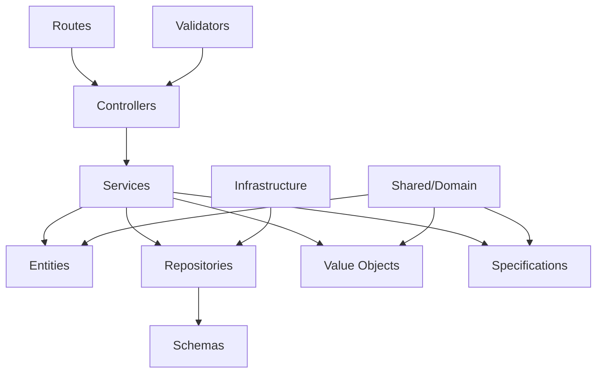
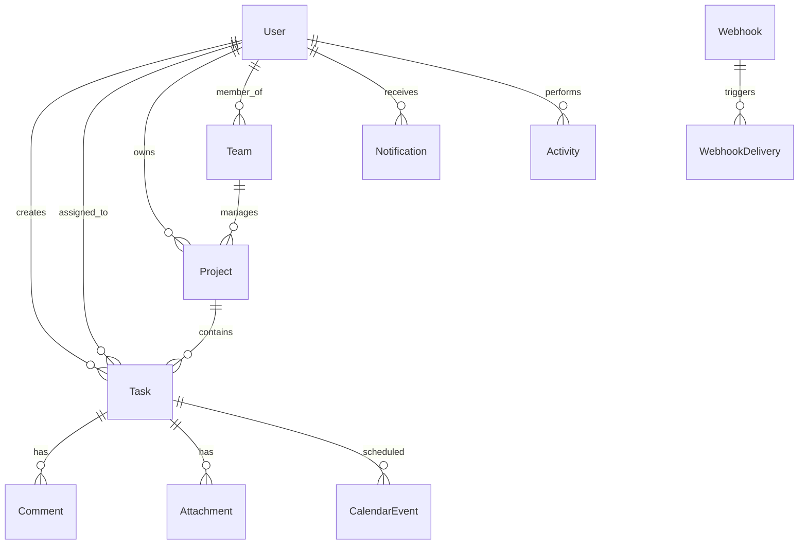

# Design Document

## Overview

This design document outlines the comprehensive restructuring of a TypeScript enterprise project from a traditional layered architecture to a clean, domain-driven architecture. The current project follows a horizontal layering approach (presentation → application → domain → infrastructure) which creates tight coupling, code duplication, and unclear boundaries. The new architecture will organize code vertically by business domains, with each domain being self-contained and cohesive.

### Current Architecture Problems

1. **Service Duplication**: Services exist in both `src/application/services/` and `src/domain/*/services/`
2. **Scattered Domain Logic**: Domain-related files are spread across multiple layers
3. **Tight Coupling**: Cross-layer dependencies make testing and maintenance difficult
4. **Unclear Boundaries**: It's unclear which layer owns specific functionality
5. **Inconsistent Structure**: Different domains have different organizational patterns

### Target Architecture Benefits

1. **Domain Isolation**: Each domain is self-contained with clear boundaries
2. **Reduced Coupling**: Dependencies flow inward toward domain core
3. **Improved Testability**: Domain logic can be tested independently
4. **Better Maintainability**: Changes in one domain don't affect others
5. **Scalable Development**: Teams can work on different domains independently

## Architecture

### High-Level Structure

```
src/
├── shared/                    # Cross-domain shared resources
│   ├── domain/               # Base domain classes and interfaces
│   ├── middleware/           # Express/Fastify middleware
│   ├── config/              # Configuration management
│   ├── utils/               # Utility functions
│   └── types/               # Shared TypeScript types
├── domains/                  # Business domains (vertical slices)
│   ├── analytics/
│   ├── authentication/
│   ├── calendar/
│   ├── collaboration/
│   ├── file-management/
│   ├── notification/
│   ├── search/
│   ├── task-management/
│   ├── webhook/
│   ├── system-monitoring/
│   └── audit/
├── infrastructure/           # Technical infrastructure only
│   ├── database/
│   ├── cache/
│   ├── external-services/
│   ├── monitoring/
│   ├── storage/
│   └── websocket/
└── app.ts                   # Application entry point
```

### Domain Structure Template

Each domain follows a consistent internal structure:

```
domains/[domain-name]/
├── controllers/             # HTTP request handlers
├── routes/                 # Route definitions
├── validators/             # Input validation schemas
├── services/              # Business logic services
├── entities/              # Domain entities
├── repositories/          # Data access interfaces and implementations
├── schemas/               # Database schemas
├── events/                # Domain events
├── value-objects/         # Value objects
└── specifications/        # Business rules and specifications
```

### Dependency Flow



## Components and Interfaces

### Shared Components

#### 1. Shared Domain (`src/shared/domain/`)

**Base Entity**

```typescript
// src/shared/domain/base-entity.ts
export abstract class BaseEntity {
  protected constructor(
    public readonly id: string,
    public readonly createdAt: Date,
    public readonly updatedAt: Date
  ) {}

  abstract validate(): void;
  abstract toPrimitive(): Record<string, any>;
}
```

**Domain Event**

```typescript
// src/shared/domain/domain-event.ts
export interface DomainEvent {
  readonly eventId: string;
  readonly aggregateId: string;
  readonly eventType: string;
  readonly occurredOn: Date;
  readonly eventData: Record<string, any>;
}
```

**Repository Interface**

```typescript
// src/shared/domain/repository.ts
export interface Repository<T, ID> {
  findById(id: ID): Promise<T | null>;
  save(entity: T): Promise<T>;
  delete(id: ID): Promise<void>;
  findAll(criteria?: any): Promise<T[]>;
}
```

#### 2. Shared Middleware (`src/shared/middleware/`)

All Express/Fastify middleware will be centralized here:

- Authentication middleware
- Rate limiting
- Error handling
- Request logging
- Security middleware
- API versioning

#### 3. Shared Configuration (`src/shared/config/`)

Configuration management including:

- Environment variables
- Database configuration
- External service configurations
- Feature flags
- Logging configuration

#### 4. Shared Utils (`src/shared/utils/`)

Common utilities:

- Response formatters
- Error classes
- Performance monitors
- Validation helpers
- Date/time utilities

### Domain Components

#### 1. Controllers Layer

**Responsibilities:**

- Handle HTTP requests/responses
- Input validation coordination
- Response formatting
- Error handling delegation

**Example Structure:**

```typescript
// src/domains/task-management/controllers/task.controller.ts
export class TaskController {
  constructor(
    private taskService: TaskService,
    private validator: TaskValidator
  ) {}

  async createTask(req: Request, res: Response): Promise<void> {
    const validatedData = await this.validator.validateCreateTask(req.body);
    const task = await this.taskService.createTask(validatedData);
    res.json(successResponse(task, 'Task created successfully'));
  }
}
```

#### 2. Routes Layer

**Responsibilities:**

- Define HTTP routes
- Route-specific middleware
- Controller method binding

**Example Structure:**

```typescript
// src/domains/task-management/routes/task.routes.ts
export const taskRoutes = (router: Router) => {
  router.post('/tasks', authMiddleware, taskController.createTask);
  router.get('/tasks/:id', authMiddleware, taskController.getTask);
  router.put('/tasks/:id', authMiddleware, taskController.updateTask);
  router.delete('/tasks/:id', authMiddleware, taskController.deleteTask);
};
```

#### 3. Services Layer

**Responsibilities:**

- Business logic implementation
- Domain rule enforcement
- Transaction coordination
- Event publishing

**Example Structure:**

```typescript
// src/domains/task-management/services/task.service.ts
export class TaskService {
  constructor(
    private taskRepository: TaskRepository,
    private eventBus: EventBus
  ) {}

  async createTask(data: CreateTaskData): Promise<Task> {
    const task = Task.create(data);
    task.validate();

    const savedTask = await this.taskRepository.save(task);
    await this.eventBus.publish(new TaskCreatedEvent(savedTask));

    return savedTask;
  }
}
```

#### 4. Entities Layer

**Responsibilities:**

- Domain model representation
- Business rule enforcement
- State management
- Invariant protection

#### 5. Repositories Layer

**Responsibilities:**

- Data persistence abstraction
- Query implementation
- Database schema mapping
- Transaction management

#### 6. Schemas Layer

**Responsibilities:**

- Database table definitions
- Relationships mapping
- Indexes and constraints
- Migration support

### Infrastructure Components

#### 1. Database Infrastructure

**Components:**

- Connection management
- Health checks
- Migration system
- Transaction management
- Query optimization

**Structure:**

```
infrastructure/database/
├── connection.ts           # Database connection setup
├── health-check.ts        # Database health monitoring
├── migration-system.ts    # Schema migration management
├── transaction-manager.ts # Transaction coordination
└── drizzle/
    ├── connection.ts      # Drizzle-specific setup
    ├── migrations/        # Migration files
    └── setup.ts          # Drizzle configuration
```

#### 2. Cache Infrastructure

Redis-based caching system for:

- Session management
- Query result caching
- Rate limiting data
- Temporary data storage

#### 3. External Services Infrastructure

Integration with external APIs:

- HTTP client configuration
- Circuit breaker patterns
- Retry mechanisms
- Service discovery

## Data Models

### Domain Entity Relationships



### Schema Migration Strategy

1. **Phase 1**: Create new domain directories without moving schemas
2. **Phase 2**: Copy schemas to domain directories
3. **Phase 3**: Update import statements in repositories
4. **Phase 4**: Remove old schema files
5. **Phase 5**: Verify all references are updated

## Error Handling

### Domain-Specific Error Types

Each domain will define its own error types extending base error classes:

```typescript
// src/shared/domain/errors/domain-error.ts
export abstract class DomainError extends Error {
  abstract readonly code: string;
  abstract readonly statusCode: number;
}

// src/domains/task-management/errors/task-errors.ts
export class TaskNotFoundError extends DomainError {
  readonly code = 'TASK_NOT_FOUND';
  readonly statusCode = 404;

  constructor(taskId: string) {
    super(`Task with ID ${taskId} not found`);
  }
}
```

### Error Handling Flow

1. **Domain Layer**: Throws domain-specific errors
2. **Service Layer**: Catches and transforms errors if needed
3. **Controller Layer**: Catches service errors and formats responses
4. **Middleware Layer**: Global error handler for unhandled errors

## Testing Strategy

### Unit Testing Structure

Each domain will have its own test structure mirroring the source structure:

```
domains/[domain-name]/
├── __tests__/
│   ├── controllers/
│   ├── services/
│   ├── entities/
│   ├── repositories/
│   └── validators/
```

### Testing Patterns

1. **Entity Tests**: Test business rules and invariants
2. **Service Tests**: Test business logic with mocked dependencies
3. **Repository Tests**: Test data access with test database
4. **Controller Tests**: Test HTTP handling with mocked services
5. **Integration Tests**: Test complete domain workflows

### Test Data Management

- **Factories**: Create test entities with valid data
- **Builders**: Fluent interface for test data creation
- **Fixtures**: Predefined test data sets
- **Database Seeding**: Consistent test database state

## Migration Implementation Plan

### Phase 1: Preparation and Analysis

1. **Current State Analysis**
   - Scan all domains in `src/domain/`
   - Catalog controllers, routes, validators by domain
   - Identify service duplications
   - Map repositories and schemas to domains

2. **Backup Creation**
   - Create timestamped backup of entire `src/` directory
   - Document current import dependencies
   - Create rollback procedures

### Phase 2: Directory Structure Creation

1. **Shared Directories**

   ```powershell
   New-Item -ItemType Directory -Force -Path "src\shared\domain"
   New-Item -ItemType Directory -Force -Path "src\shared\middleware"
   New-Item -ItemType Directory -Force -Path "src\shared\config"
   New-Item -ItemType Directory -Force -Path "src\shared\utils"
   New-Item -ItemType Directory -Force -Path "src\shared\types"
   ```

2. **Domain Directories**

   ```powershell
   # For each identified domain
   $domains = @("analytics", "authentication", "calendar", "collaboration",
                "file-management", "notification", "search", "task-management",
                "webhook", "system-monitoring", "audit")

   foreach ($domain in $domains) {
       New-Item -ItemType Directory -Force -Path "src\domains\$domain\controllers"
       New-Item -ItemType Directory -Force -Path "src\domains\$domain\routes"
       New-Item -ItemType Directory -Force -Path "src\domains\$domain\validators"
       New-Item -ItemType Directory -Force -Path "src\domains\$domain\services"
       New-Item -ItemType Directory -Force -Path "src\domains\$domain\entities"
       New-Item -ItemType Directory -Force -Path "src\domains\$domain\repositories"
       New-Item -ItemType Directory -Force -Path "src\domains\$domain\schemas"
       New-Item -ItemType Directory -Force -Path "src\domains\$domain\events"
       New-Item -ItemType Directory -Force -Path "src\domains\$domain\value-objects"
       New-Item -ItemType Directory -Force -Path "src\domains\$domain\specifications"
   }
   ```

### Phase 3: Shared Resources Migration

1. **Move Shared Domain Files**

   ```powershell
   Move-Item "src\domain\shared\*" "src\shared\domain\" -Force
   ```

2. **Move Middleware**

   ```powershell
   Move-Item "src\presentation\middleware\*" "src\shared\middleware\" -Force
   ```

3. **Move Configuration**

   ```powershell
   Move-Item "src\infrastructure\config\*" "src\shared\config\" -Force
   ```

4. **Move Utilities**
   ```powershell
   Move-Item "src\utils\*" "src\shared\utils\" -Force
   ```

### Phase 4: Domain-Specific Migration

For each domain, execute the following migration pattern:

#### Analytics Domain

```powershell
# Controllers
Move-Item "src\presentation\controllers\analytics.controller.ts" "src\domains\analytics\controllers\" -Force
Move-Item "src\presentation\controllers\activity.controller.ts" "src\domains\analytics\controllers\" -Force
Move-Item "src\presentation\controllers\dashboard.controller.ts" "src\domains\analytics\controllers\" -Force

# Routes
Move-Item "src\presentation\routes\analytics.routes.ts" "src\domains\analytics\routes\" -Force
Move-Item "src\presentation\routes\activity.routes.ts" "src\domains\analytics\routes\" -Force
Move-Item "src\presentation\routes\dashboard.routes.ts" "src\domains\analytics\routes\" -Force

# Validators
Move-Item "src\presentation\validators\activity.validator.ts" "src\domains\analytics\validators\" -Force

# Services (consolidate duplicates)
Move-Item "src\domain\analytics\services\*" "src\domains\analytics\services\" -Force

# Entities
Move-Item "src\domain\analytics\entities\*" "src\domains\analytics\entities\" -Force

# Repositories
Move-Item "src\domain\analytics\repositories\*" "src\domains\analytics\repositories\" -Force

# Schemas
Move-Item "src\infrastructure\database\drizzle\schema\activities.ts" "src\domains\analytics\schemas\" -Force

# Value Objects
Move-Item "src\domain\analytics\value-objects\*" "src\domains\analytics\value-objects\" -Force
```

#### Task Management Domain (Largest Domain)

```powershell
# Controllers
$taskControllers = @(
    "task.controller.ts",
    "enhanced-task.controller.ts",
    "project.controller.ts",
    "workspace.controller.ts",
    "team.controller.ts",
    "task-template.controller.ts",
    "recurring-task.controller.ts",
    "invitation.controller.ts"
)

foreach ($controller in $taskControllers) {
    Move-Item "src\presentation\controllers\$controller" "src\domains\task-management\controllers\" -Force
}

# Routes
$taskRoutes = @(
    "task.routes.ts",
    "enhanced-task.routes.ts",
    "project.routes.ts",
    "workspace.routes.ts",
    "team.routes.ts",
    "task-template.routes.ts",
    "recurring-task.routes.ts",
    "invitation.routes.ts"
)

foreach ($route in $taskRoutes) {
    Move-Item "src\presentation\routes\$route" "src\domains\task-management\routes\" -Force
}

# Validators
$taskValidators = @(
    "task.validator.ts",
    "project.validator.ts",
    "workspace.validator.ts",
    "team.validator.ts",
    "task-template.validator.ts",
    "recurring-task.validator.ts",
    "invitation.validator.ts"
)

foreach ($validator in $taskValidators) {
    Move-Item "src\presentation\validators\$validator" "src\domains\task-management\validators\" -Force
}

# Services (consolidate)
Move-Item "src\domain\task-management\services\*" "src\domains\task-management\services\" -Force

# Entities
Move-Item "src\domain\task-management\entities\*" "src\domains\task-management\entities\" -Force

# Repositories
Move-Item "src\domain\task-management\repositories\*" "src\domains\task-management\repositories\" -Force
Move-Item "src\infrastructure\repositories\task.repository.impl.ts" "src\domains\task-management\repositories\" -Force
Move-Item "src\infrastructure\repositories\project.repository.impl.ts" "src\domains\task-management\repositories\" -Force

# Schemas
$taskSchemas = @(
    "tasks.ts",
    "projects.ts",
    "workspaces.ts",
    "teams.ts",
    "invitations.ts",
    "task-templates.ts",
    "recurring-tasks.ts"
)

foreach ($schema in $taskSchemas) {
    Move-Item "src\infrastructure\database\drizzle\schema\$schema" "src\domains\task-management\schemas\" -Force
}

# Events
Move-Item "src\domain\task-management\events\*" "src\domains\task-management\events\" -Force

# Specifications
Move-Item "src\domain\task-management\specifications\*" "src\domains\task-management\specifications\" -Force

# Value Objects
Move-Item "src\domain\task-management\value-objects\*" "src\domains\task-management\value-objects\" -Force
```

### Phase 5: Import Statement Updates

Create a comprehensive import mapping and update all files:

```powershell
function Update-Imports {
    param(
        [string]$FilePath,
        [hashtable]$ImportMappings
    )

    $content = Get-Content $FilePath -Raw

    foreach ($oldPath in $ImportMappings.Keys) {
        $newPath = $ImportMappings[$oldPath]
        $content = $content -replace [regex]::Escape($oldPath), $newPath
    }

    Set-Content $FilePath $content -NoNewline
}

# Define comprehensive import mappings
$importMappings = @{
    # Shared resources
    'src/domain/shared' = '../../shared/domain'
    'src/utils' = '../../shared/utils'
    'src/infrastructure/config' = '../../shared/config'
    'src/presentation/middleware' = '../../shared/middleware'

    # Domain-specific mappings (within domains)
    'src/presentation/controllers' = '../controllers'
    'src/presentation/routes' = '../routes'
    'src/presentation/validators' = '../validators'
    'src/domain/[domain]/services' = '../services'
    'src/domain/[domain]/entities' = '../entities'
    'src/domain/[domain]/repositories' = '../repositories'
    'src/infrastructure/database/drizzle/schema' = '../schemas'

    # Cross-domain references
    'src/domain/analytics' = '../analytics'
    'src/domain/authentication' = '../authentication'
    'src/domain/task-management' = '../task-management'
}

# Apply to all TypeScript files
Get-ChildItem "src" -Filter "*.ts" -Recurse | ForEach-Object {
    Update-Imports $_.FullName $importMappings
}
```

### Phase 6: Infrastructure Cleanup

1. **Clean Database Infrastructure**

   ```powershell
   # Keep only technical infrastructure
   $keepFiles = @(
       "connection.ts",
       "health-check.ts",
       "migration-system.ts",
       "transaction-manager.ts"
   )

   # Remove domain-specific files that were moved
   Get-ChildItem "src\infrastructure\database\drizzle\repositories" -Filter "*.ts" |
       Where-Object { $_.Name -notin $keepFiles } | Remove-Item -Force
   ```

2. **Update Infrastructure Imports**
   - Update database connection imports
   - Update repository registrations
   - Update schema imports in migrations

### Phase 7: Verification and Testing

1. **Structure Verification**

   ```powershell
   # Verify all expected directories exist
   $expectedDirs = @(
       "src\shared\domain",
       "src\shared\middleware",
       "src\shared\config",
       "src\shared\utils",
       "src\domains\analytics",
       "src\domains\authentication",
       "src\domains\task-management"
   )

   foreach ($dir in $expectedDirs) {
       if (Test-Path $dir) {
           Write-Host "✓ $dir exists" -ForegroundColor Green
       } else {
           Write-Host "✗ $dir missing" -ForegroundColor Red
       }
   }
   ```

2. **Compilation Check**

   ```powershell
   npx tsc --noEmit
   if ($LASTEXITCODE -eq 0) {
       Write-Host "✓ TypeScript compilation successful" -ForegroundColor Green
   } else {
       Write-Host "✗ TypeScript compilation failed" -ForegroundColor Red
   }
   ```

3. **Test Execution**
   ```powershell
   npm test
   ```

## Risk Mitigation

### Potential Risks

1. **Import Statement Complexity**: Many files will need import updates
2. **Circular Dependencies**: Domain boundaries might create circular imports
3. **Build System Impact**: Path mappings in tsconfig.json need updates
4. **Test Suite Breakage**: Test imports will need comprehensive updates

### Mitigation Strategies

1. **Incremental Migration**: Migrate one domain at a time
2. **Automated Testing**: Run tests after each domain migration
3. **Import Validation**: Use TypeScript compiler to catch import errors
4. **Rollback Procedures**: Maintain ability to revert changes
5. **Documentation**: Keep detailed logs of all changes made

## Success Metrics

1. **Code Organization**: Each domain is self-contained
2. **Compilation Success**: TypeScript compiles without errors
3. **Test Coverage**: All tests pass after migration
4. **Import Cleanliness**: No cross-domain imports except through shared interfaces
5. **Performance**: No degradation in build or runtime performance
