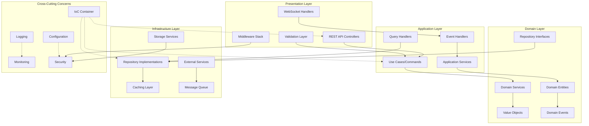
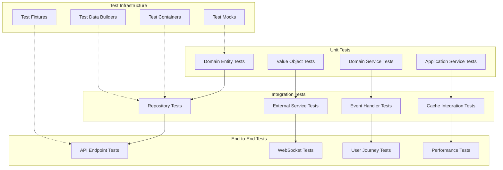

# Enterprise Platform Unification - Design Document

## Overview

This design document outlines the comprehensive architecture for transforming the Unified Enterprise Platform from a collection of well-designed but disconnected components into a fully integrated, production-ready, enterprise-grade task management backend. The design focuses on creating seamless connections between all layers while maintaining the existing Domain-Driven Design and Clean Architecture principles.

The system will function as a single, cohesive unit where every layer builds upon and seamlessly connects to others, ensuring that all components contribute to the overall system functionality.

## Architecture

### High-Level Architecture



### Layer Integration Strategy

#### 1. Foundation Layer (Database + Domain)
- **Prisma Schema Alignment**: Every Prisma model maps to a domain entity with rich business logic
- **Repository Pattern**: Complete abstraction between domain and infrastructure
- **Transaction Management**: Unit of Work pattern for complex operations
- **Event Sourcing**: Domain events for audit trails and integration

#### 2. Application Orchestration Layer
- **CQRS Implementation**: Separate command and query responsibilities
- **Use Case Orchestration**: Business workflows as first-class citizens
- **Event-Driven Communication**: Loose coupling through domain events
- **Service Composition**: Higher-level business operations

#### 3. Infrastructure Integration Layer
- **Multi-Provider Support**: Pluggable implementations for external services
- **Caching Strategy**: Distributed caching with intelligent invalidation
- **Message Queue Integration**: Reliable async processing
- **Health Monitoring**: Deep health checks for all dependencies

#### 4. Presentation Unification Layer
- **Consistent API Patterns**: Standardized request/response handling
- **Unified Authentication**: Single authentication strategy across all endpoints
- **Comprehensive Validation**: Input validation at presentation boundary
- **Real-time Integration**: WebSocket events synchronized with REST operations

## Components and Interfaces

### 1. Dependency Injection Container

```typescript
interface IContainer {
  register<T>(token: string, implementation: Constructor<T>, lifecycle: Lifecycle): void;
  registerSingleton<T>(token: string, implementation: Constructor<T>): void;
  registerTransient<T>(token: string, implementation: Constructor<T>): void;
  registerScoped<T>(token: string, implementation: Constructor<T>): void;
  resolve<T>(token: string): T;
  createScope(): IContainer;
  dispose(): Promise<void>;
}

interface IServiceRegistry {
  registerDomainServices(container: IContainer): void;
  registerApplicationServices(container: IContainer): void;
  registerInfrastructureServices(container: IContainer): void;
  registerPresentationServices(container: IContainer): void;
}
```

### 2. Unified Repository Pattern

```typescript
interface IUnitOfWork {
  begin(): Promise<void>;
  commit(): Promise<void>;
  rollback(): Promise<void>;
  saveChanges(): Promise<void>;
  
  users: IUserRepository;
  tasks: ITaskRepository;
  projects: IProjectRepository;
  workspaces: IWorkspaceRepository;
  // ... all other repositories
}

interface IRepository<T extends Entity> {
  findById(id: string): Promise<T | null>;
  findMany(specification: ISpecification<T>): Promise<T[]>;
  findOne(specification: ISpecification<T>): Promise<T | null>;
  create(entity: T): Promise<T>;
  update(entity: T): Promise<T>;
  delete(id: string): Promise<void>;
  count(specification?: ISpecification<T>): Promise<number>;
}
```

### 3. Event-Driven Architecture

```typescript
interface IDomainEventBus {
  publish<T extends DomainEvent>(event: T): Promise<void>;
  publishMany(events: DomainEvent[]): Promise<void>;
  subscribe<T extends DomainEvent>(
    eventType: Constructor<T>,
    handler: IDomainEventHandler<T>
  ): void;
}

interface IIntegrationEventBus {
  publish<T extends IntegrationEvent>(event: T): Promise<void>;
  subscribe<T extends IntegrationEvent>(
    eventType: Constructor<T>,
    handler: IIntegrationEventHandler<T>
  ): void;
}

interface IWebSocketEventBus {
  broadcast(event: WebSocketEvent): Promise<void>;
  broadcastToRoom(room: string, event: WebSocketEvent): Promise<void>;
  broadcastToUser(userId: string, event: WebSocketEvent): Promise<void>;
}
```

### 4. Caching Strategy

```typescript
interface ICacheManager {
  get<T>(key: string): Promise<T | null>;
  set<T>(key: string, value: T, ttl?: number): Promise<void>;
  delete(key: string): Promise<void>;
  deletePattern(pattern: string): Promise<void>;
  exists(key: string): Promise<boolean>;
  
  // Cache-aside pattern helpers
  getOrSet<T>(
    key: string,
    factory: () => Promise<T>,
    ttl?: number
  ): Promise<T>;
}

interface ICacheInvalidationStrategy {
  invalidateForEntity(entityType: string, entityId: string): Promise<void>;
  invalidateForUser(userId: string): Promise<void>;
  invalidateForWorkspace(workspaceId: string): Promise<void>;
}
```

### 5. Configuration Management

```typescript
interface IConfigurationProvider {
  get<T>(key: string): T;
  getRequired<T>(key: string): T;
  getSection<T>(section: string): T;
  validate(): Promise<ValidationResult>;
  reload(): Promise<void>;
}

interface IFeatureFlags {
  isEnabled(flag: string, context?: FeatureFlagContext): Promise<boolean>;
  getVariant(flag: string, context?: FeatureFlagContext): Promise<string>;
}
```

## Data Models

### 1. Domain Entity Base Classes

```typescript
abstract class Entity {
  protected constructor(public readonly id: string) {}
  
  private _domainEvents: DomainEvent[] = [];
  
  protected addDomainEvent(event: DomainEvent): void {
    this._domainEvents.push(event);
  }
  
  public getDomainEvents(): DomainEvent[] {
    return [...this._domainEvents];
  }
  
  public clearDomainEvents(): void {
    this._domainEvents = [];
  }
}

abstract class AggregateRoot extends Entity {
  private _version: number = 0;
  
  public get version(): number {
    return this._version;
  }
  
  public incrementVersion(): void {
    this._version++;
  }
}
```

### 2. Rich Domain Models

```typescript
class Task extends AggregateRoot {
  private constructor(
    id: string,
    private _title: TaskTitle,
    private _description: TaskDescription,
    private _status: TaskStatus,
    private _priority: Priority,
    private _assigneeId: UserId | null,
    private _creatorId: UserId,
    private _workspaceId: WorkspaceId,
    private _projectId: ProjectId | null
  ) {
    super(id);
  }
  
  public static create(props: CreateTaskProps): Task {
    const task = new Task(
      generateId(),
      props.title,
      props.description,
      TaskStatus.TODO,
      props.priority,
      props.assigneeId,
      props.creatorId,
      props.workspaceId,
      props.projectId
    );
    
    task.addDomainEvent(new TaskCreatedEvent(task));
    return task;
  }
  
  public assignTo(assigneeId: UserId, assignedBy: UserId): void {
    if (this._assigneeId?.equals(assigneeId)) {
      return; // Already assigned to this user
    }
    
    const previousAssignee = this._assigneeId;
    this._assigneeId = assigneeId;
    
    this.addDomainEvent(new TaskAssignedEvent(
      this.id,
      assigneeId,
      previousAssignee,
      assignedBy
    ));
  }
  
  public updateStatus(newStatus: TaskStatus, updatedBy: UserId): void {
    if (this._status.equals(newStatus)) {
      return; // Status unchanged
    }
    
    const previousStatus = this._status;
    this._status = newStatus;
    
    if (newStatus.isCompleted()) {
      this.addDomainEvent(new TaskCompletedEvent(this.id, updatedBy));
    }
    
    this.addDomainEvent(new TaskStatusUpdatedEvent(
      this.id,
      newStatus,
      previousStatus,
      updatedBy
    ));
  }
  
  // Getters and other business methods...
}
```

### 3. Value Objects

```typescript
class TaskTitle extends ValueObject {
  private constructor(private readonly _value: string) {
    super();
  }
  
  public static create(value: string): TaskTitle {
    if (!value || value.trim().length === 0) {
      throw new DomainError('Task title cannot be empty');
    }
    
    if (value.length > 200) {
      throw new DomainError('Task title cannot exceed 200 characters');
    }
    
    return new TaskTitle(value.trim());
  }
  
  public get value(): string {
    return this._value;
  }
  
  protected getEqualityComponents(): any[] {
    return [this._value];
  }
}
```

## Error Handling

### 1. Error Hierarchy

```typescript
abstract class AppError extends Error {
  abstract readonly statusCode: number;
  abstract readonly isOperational: boolean;
  
  constructor(message: string, public readonly context?: Record<string, any>) {
    super(message);
    this.name = this.constructor.name;
  }
}

class DomainError extends AppError {
  readonly statusCode = 400;
  readonly isOperational = true;
}

class ValidationError extends AppError {
  readonly statusCode = 400;
  readonly isOperational = true;
  
  constructor(
    message: string,
    public readonly validationErrors: ValidationErrorDetail[]
  ) {
    super(message);
  }
}

class NotFoundError extends AppError {
  readonly statusCode = 404;
  readonly isOperational = true;
}

class UnauthorizedError extends AppError {
  readonly statusCode = 401;
  readonly isOperational = true;
}

class ForbiddenError extends AppError {
  readonly statusCode = 403;
  readonly isOperational = true;
}
```

### 2. Global Error Handler

```typescript
interface IErrorHandler {
  handle(error: Error, context: ErrorContext): Promise<ErrorResponse>;
  isOperationalError(error: Error): boolean;
}

class GlobalErrorHandler implements IErrorHandler {
  constructor(
    private readonly logger: ILogger,
    private readonly notificationService: INotificationService
  ) {}
  
  async handle(error: Error, context: ErrorContext): Promise<ErrorResponse> {
    const correlationId = context.correlationId || generateCorrelationId();
    
    // Log error with context
    this.logger.error('Application error occurred', {
      error: error.message,
      stack: error.stack,
      correlationId,
      context
    });
    
    // Handle specific error types
    if (error instanceof ValidationError) {
      return this.handleValidationError(error, correlationId);
    }
    
    if (error instanceof DomainError) {
      return this.handleDomainError(error, correlationId);
    }
    
    if (error instanceof NotFoundError) {
      return this.handleNotFoundError(error, correlationId);
    }
    
    // Handle unexpected errors
    if (!this.isOperationalError(error)) {
      await this.notificationService.notifyAdmins(
        new CriticalErrorNotification(error, context)
      );
    }
    
    return this.handleGenericError(error, correlationId);
  }
}
```

## Testing Strategy

### 1. Testing Architecture



### 2. Test Infrastructure

```typescript
interface ITestContainer {
  startPostgreSQL(): Promise<PostgreSQLContainer>;
  startRedis(): Promise<RedisContainer>;
  startEmailServer(): Promise<MailHogContainer>;
  cleanup(): Promise<void>;
}

interface ITestDataBuilder {
  createUser(overrides?: Partial<User>): User;
  createTask(overrides?: Partial<Task>): Task;
  createProject(overrides?: Partial<Project>): Project;
  createWorkspace(overrides?: Partial<Workspace>): Workspace;
}

interface ITestFixtures {
  loadUserFixtures(): Promise<User[]>;
  loadTaskFixtures(): Promise<Task[]>;
  loadProjectFixtures(): Promise<Project[]>;
  clearAllFixtures(): Promise<void>;
}
```

### 3. Testing Patterns

```typescript
// Domain Entity Testing
describe('Task Entity', () => {
  describe('assignTo', () => {
    it('should assign task to user and publish domain event', () => {
      // Arrange
      const task = TaskBuilder.create()
        .withTitle('Test Task')
        .withCreator(userId)
        .build();
      
      const assigneeId = UserId.create();
      const assignedBy = UserId.create();
      
      // Act
      task.assignTo(assigneeId, assignedBy);
      
      // Assert
      expect(task.assigneeId).toEqual(assigneeId);
      
      const events = task.getDomainEvents();
      expect(events).toHaveLength(1);
      expect(events[0]).toBeInstanceOf(TaskAssignedEvent);
    });
  });
});

// Integration Testing
describe('TaskRepository Integration', () => {
  let container: ITestContainer;
  let repository: ITaskRepository;
  
  beforeAll(async () => {
    container = new TestContainer();
    await container.startPostgreSQL();
    repository = container.resolve<ITaskRepository>('TaskRepository');
  });
  
  afterAll(async () => {
    await container.cleanup();
  });
  
  it('should persist and retrieve task with all relationships', async () => {
    // Arrange
    const task = TaskBuilder.create()
      .withTitle('Integration Test Task')
      .withProject(projectId)
      .build();
    
    // Act
    const savedTask = await repository.create(task);
    const retrievedTask = await repository.findById(savedTask.id);
    
    // Assert
    expect(retrievedTask).toBeDefined();
    expect(retrievedTask!.title.value).toBe('Integration Test Task');
    expect(retrievedTask!.projectId).toEqual(projectId);
  });
});
```

## Performance Optimization

### 1. Database Optimization

```typescript
interface IQueryOptimizer {
  optimizeQuery(query: QueryBuilder): QueryBuilder;
  addIndexHints(query: QueryBuilder, hints: IndexHint[]): QueryBuilder;
  analyzeQueryPlan(query: string): Promise<QueryPlan>;
}

interface IConnectionPoolManager {
  getConnection(): Promise<DatabaseConnection>;
  releaseConnection(connection: DatabaseConnection): void;
  getPoolStats(): PoolStats;
  optimizePoolSize(): Promise<void>;
}

// Database indexes configuration
const DATABASE_INDEXES = {
  tasks: [
    { fields: ['workspace_id', 'status'], name: 'idx_tasks_workspace_status' },
    { fields: ['assignee_id', 'due_date'], name: 'idx_tasks_assignee_due' },
    { fields: ['project_id', 'created_at'], name: 'idx_tasks_project_created' },
    { fields: ['title'], type: 'gin', name: 'idx_tasks_title_search' }
  ],
  projects: [
    { fields: ['workspace_id', 'status'], name: 'idx_projects_workspace_status' },
    { fields: ['owner_id', 'created_at'], name: 'idx_projects_owner_created' }
  ]
  // ... other indexes
};
```

### 2. Caching Strategy

```typescript
interface ICacheStrategy {
  shouldCache(operation: string, context: CacheContext): boolean;
  generateKey(operation: string, params: any[]): string;
  getTTL(operation: string): number;
  getInvalidationRules(operation: string): InvalidationRule[];
}

class TaskCacheStrategy implements ICacheStrategy {
  shouldCache(operation: string, context: CacheContext): boolean {
    // Cache read operations but not writes
    return operation.startsWith('find') || operation.startsWith('get');
  }
  
  generateKey(operation: string, params: any[]): string {
    return `task:${operation}:${hashParams(params)}`;
  }
  
  getTTL(operation: string): number {
    switch (operation) {
      case 'findById': return 300; // 5 minutes
      case 'findByProject': return 60; // 1 minute
      default: return 30; // 30 seconds
    }
  }
  
  getInvalidationRules(operation: string): InvalidationRule[] {
    return [
      { pattern: 'task:*', events: ['TaskUpdated', 'TaskDeleted'] },
      { pattern: 'project:*', events: ['TaskCreated', 'TaskMoved'] }
    ];
  }
}
```

### 3. Performance Monitoring

```typescript
interface IPerformanceMonitor {
  startTimer(operation: string): PerformanceTimer;
  recordMetric(name: string, value: number, tags?: Record<string, string>): void;
  recordHistogram(name: string, value: number, tags?: Record<string, string>): void;
  incrementCounter(name: string, tags?: Record<string, string>): void;
}

class PerformanceInterceptor {
  constructor(private readonly monitor: IPerformanceMonitor) {}
  
  intercept(target: any, propertyKey: string, descriptor: PropertyDescriptor) {
    const originalMethod = descriptor.value;
    
    descriptor.value = async function (...args: any[]) {
      const timer = this.monitor.startTimer(`${target.constructor.name}.${propertyKey}`);
      
      try {
        const result = await originalMethod.apply(this, args);
        timer.stop({ status: 'success' });
        return result;
      } catch (error) {
        timer.stop({ status: 'error', error: error.constructor.name });
        throw error;
      }
    };
    
    return descriptor;
  }
}
```

## Security Implementation

### 1. Authentication & Authorization

```typescript
interface IAuthenticationService {
  authenticate(credentials: Credentials): Promise<AuthenticationResult>;
  validateToken(token: string): Promise<TokenValidationResult>;
  refreshToken(refreshToken: string): Promise<TokenPair>;
  revokeToken(token: string): Promise<void>;
}

interface IAuthorizationService {
  authorize(user: User, resource: string, action: string): Promise<boolean>;
  getPermissions(user: User, workspace: Workspace): Promise<Permission[]>;
  checkPermission(user: User, permission: Permission): Promise<boolean>;
}

class JWTAuthenticationService implements IAuthenticationService {
  constructor(
    private readonly userRepository: IUserRepository,
    private readonly tokenService: ITokenService,
    private readonly passwordService: IPasswordService
  ) {}
  
  async authenticate(credentials: Credentials): Promise<AuthenticationResult> {
    const user = await this.userRepository.findByEmail(credentials.email);
    
    if (!user) {
      throw new UnauthorizedError('Invalid credentials');
    }
    
    const isValidPassword = await this.passwordService.verify(
      credentials.password,
      user.passwordHash
    );
    
    if (!isValidPassword) {
      await this.handleFailedLogin(user);
      throw new UnauthorizedError('Invalid credentials');
    }
    
    const tokens = await this.tokenService.generateTokenPair(user);
    await this.recordSuccessfulLogin(user);
    
    return {
      user,
      accessToken: tokens.accessToken,
      refreshToken: tokens.refreshToken
    };
  }
}
```

### 2. Data Protection

```typescript
interface IEncryptionService {
  encrypt(data: string, key?: string): Promise<string>;
  decrypt(encryptedData: string, key?: string): Promise<string>;
  hash(data: string): Promise<string>;
  generateKey(): Promise<string>;
}

interface IDataMaskingService {
  maskEmail(email: string): string;
  maskPhoneNumber(phone: string): string;
  maskCreditCard(cardNumber: string): string;
  shouldMaskField(fieldName: string, context: MaskingContext): boolean;
}

class AESEncryptionService implements IEncryptionService {
  constructor(private readonly keyManager: IKeyManager) {}
  
  async encrypt(data: string, key?: string): Promise<string> {
    const encryptionKey = key || await this.keyManager.getCurrentKey();
    const cipher = crypto.createCipher('aes-256-gcm', encryptionKey);
    
    let encrypted = cipher.update(data, 'utf8', 'hex');
    encrypted += cipher.final('hex');
    
    const authTag = cipher.getAuthTag();
    
    return `${encrypted}:${authTag.toString('hex')}`;
  }
  
  async decrypt(encryptedData: string, key?: string): Promise<string> {
    const [encrypted, authTag] = encryptedData.split(':');
    const decryptionKey = key || await this.keyManager.getCurrentKey();
    
    const decipher = crypto.createDecipher('aes-256-gcm', decryptionKey);
    decipher.setAuthTag(Buffer.from(authTag, 'hex'));
    
    let decrypted = decipher.update(encrypted, 'hex', 'utf8');
    decrypted += decipher.final('utf8');
    
    return decrypted;
  }
}
```

## Monitoring and Observability

### 1. Logging Strategy

```typescript
interface ILogger {
  debug(message: string, context?: LogContext): void;
  info(message: string, context?: LogContext): void;
  warn(message: string, context?: LogContext): void;
  error(message: string, error?: Error, context?: LogContext): void;
  
  createChildLogger(context: LogContext): ILogger;
}

interface ILogContext {
  correlationId?: string;
  userId?: string;
  workspaceId?: string;
  operation?: string;
  [key: string]: any;
}

class StructuredLogger implements ILogger {
  constructor(
    private readonly winston: Winston.Logger,
    private readonly context: ILogContext = {}
  ) {}
  
  info(message: string, context?: LogContext): void {
    this.winston.info(message, {
      ...this.context,
      ...context,
      timestamp: new Date().toISOString(),
      level: 'info'
    });
  }
  
  error(message: string, error?: Error, context?: LogContext): void {
    this.winston.error(message, {
      ...this.context,
      ...context,
      error: error ? {
        name: error.name,
        message: error.message,
        stack: error.stack
      } : undefined,
      timestamp: new Date().toISOString(),
      level: 'error'
    });
  }
  
  createChildLogger(context: LogContext): ILogger {
    return new StructuredLogger(this.winston, {
      ...this.context,
      ...context
    });
  }
}
```

### 2. Metrics Collection

```typescript
interface IMetricsCollector {
  recordBusinessMetric(name: string, value: number, tags?: Tags): void;
  recordTechnicalMetric(name: string, value: number, tags?: Tags): void;
  recordUserAction(action: string, userId: string, context?: MetricContext): void;
  recordSystemEvent(event: string, context?: MetricContext): void;
}

class PrometheusMetricsCollector implements IMetricsCollector {
  private readonly businessMetrics = new Map<string, prometheus.Histogram>();
  private readonly technicalMetrics = new Map<string, prometheus.Histogram>();
  private readonly userActions = new prometheus.Counter({
    name: 'user_actions_total',
    help: 'Total number of user actions',
    labelNames: ['action', 'user_id', 'workspace_id']
  });
  
  recordBusinessMetric(name: string, value: number, tags?: Tags): void {
    let metric = this.businessMetrics.get(name);
    
    if (!metric) {
      metric = new prometheus.Histogram({
        name: `business_${name}`,
        help: `Business metric: ${name}`,
        labelNames: Object.keys(tags || {})
      });
      this.businessMetrics.set(name, metric);
    }
    
    metric.observe(tags || {}, value);
  }
  
  recordUserAction(action: string, userId: string, context?: MetricContext): void {
    this.userActions.inc({
      action,
      user_id: userId,
      workspace_id: context?.workspaceId || 'unknown'
    });
  }
}
```

### 3. Health Monitoring

```typescript
interface IHealthCheck {
  name: string;
  check(): Promise<HealthCheckResult>;
}

interface IHealthMonitor {
  registerCheck(check: IHealthCheck): void;
  runAllChecks(): Promise<HealthStatus>;
  runCheck(name: string): Promise<HealthCheckResult>;
}

class DatabaseHealthCheck implements IHealthCheck {
  name = 'database';
  
  constructor(private readonly prisma: PrismaClient) {}
  
  async check(): Promise<HealthCheckResult> {
    try {
      await this.prisma.$queryRaw`SELECT 1`;
      
      return {
        status: 'healthy',
        message: 'Database connection is working',
        timestamp: new Date(),
        responseTime: Date.now() - startTime
      };
    } catch (error) {
      return {
        status: 'unhealthy',
        message: `Database connection failed: ${error.message}`,
        timestamp: new Date(),
        error: error.message
      };
    }
  }
}
```

This comprehensive design provides the foundation for transforming your enterprise platform into a fully integrated, production-ready system. The architecture ensures that all layers are properly connected while maintaining clean separation of concerns and supporting enterprise-scale requirements.