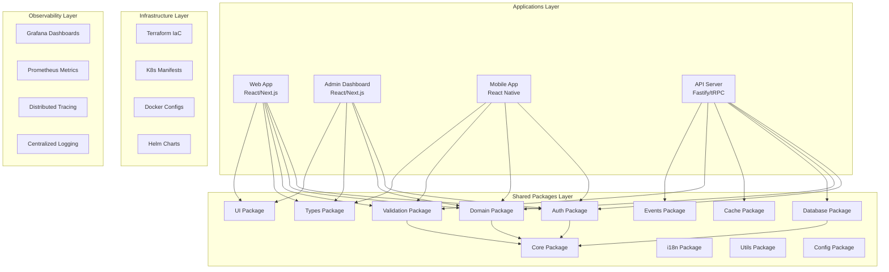
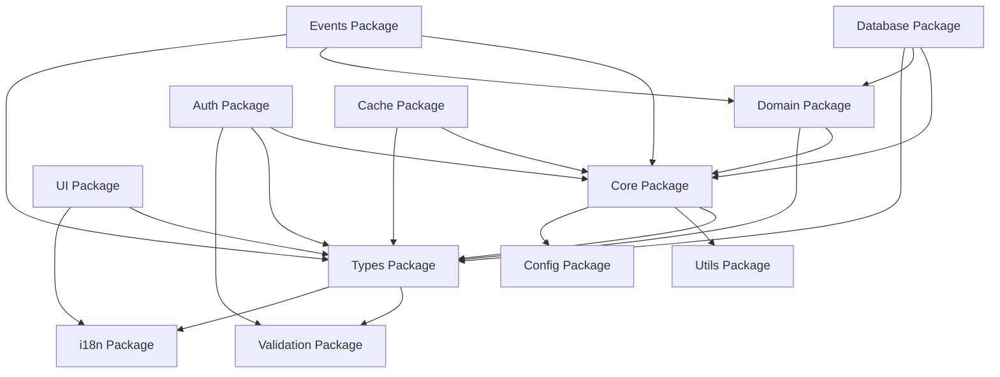
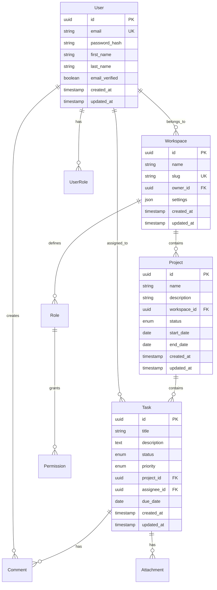

# Design Document

## Overview

This design document outlines the comprehensive transformation of the node-taskmanagement-app from a single API-focused structure into a full-stack monolith architecture. The transformation maintains the existing Clean Architecture, CQRS, and DDD patterns while expanding the system to support multiple applications sharing common business logic, infrastructure, and cross-cutting concerns.

The design follows a systematic approach: extract shared packages from the API, create new applications, establish infrastructure, and implement comprehensive tooling for development, testing, and deployment.

## Architecture

### High-Level Architecture

The transformed system follows a layered monolith architecture with clear separation of concerns:



### Package Dependency Graph

The shared packages follow a clear dependency hierarchy to prevent circular dependencies:



### Workspace Structure

The monorepo uses a workspace-based structure with clear separation between applications, shared packages, infrastructure, and tooling:

```
node-taskmanagement-app/
├── apps/                    # Application layer
├── packages/                # Shared packages
├── infrastructure/          # Infrastructure as Code
├── monitoring/             # Observability configuration
├── tools/                  # Development tools
├── docs/                   # Documentation
├── tests/                  # Global test configuration
└── scripts/                # Global scripts
```

## Components and Interfaces

### Shared Package Architecture

Each shared package follows a consistent internal structure and exposes well-defined interfaces:

#### Core Package (`packages/core/`)

**Purpose**: Provides foundational classes, utilities, and patterns used across all other packages.

**Key Components**:

- Base classes (Entity, ValueObject, AggregateRoot, DomainEvent)
- Common enums and constants
- Error definitions and handling
- Validation guards and decorators
- Design patterns (Builder, Factory, Observer)

**Interface Design**:

```typescript
// Base Entity class
export abstract class Entity<T> {
  protected constructor(protected readonly _id: T) {}

  get id(): T {
    return this._id;
  }

  equals(entity: Entity<T>): boolean {
    return this._id === entity._id;
  }
}

// Base Value Object
export abstract class ValueObject<T> {
  protected constructor(protected readonly props: T) {}

  equals(vo: ValueObject<T>): boolean {
    return JSON.stringify(this.props) === JSON.stringify(vo.props);
  }
}
```

#### Domain Package (`packages/domain/`)

**Purpose**: Contains all business logic, entities, aggregates, and domain services.

**Key Components**:

- Task, Project, User, Workspace aggregates
- Domain entities and value objects
- Business rules and specifications
- Domain events and handlers
- Repository interfaces

**Interface Design**:

```typescript
// Task Aggregate
export class Task extends AggregateRoot<TaskId> {
  private constructor(
    id: TaskId,
    private _title: TaskTitle,
    private _description: TaskDescription,
    private _status: TaskStatus,
    private _assigneeId?: UserId
  ) {
    super(id);
  }

  static create(props: CreateTaskProps): Task {
    const task = new Task(
      TaskId.generate(),
      props.title,
      props.description,
      TaskStatus.TODO,
      props.assigneeId
    );

    task.addDomainEvent(new TaskCreatedEvent(task.id, props));
    return task;
  }

  assignTo(userId: UserId): void {
    this._assigneeId = userId;
    this.addDomainEvent(new TaskAssignedEvent(this.id, userId));
  }
}
```

#### Authentication Package (`packages/auth/`)

**Purpose**: Provides comprehensive authentication and authorization services.

**Key Components**:

- JWT token management
- Multi-factor authentication (2FA, WebAuthn)
- Role-based access control (RBAC)
- Session management
- Password hashing and validation

**Interface Design**:

```typescript
// Authentication Service Interface
export interface IAuthenticationService {
  authenticate(credentials: LoginCredentials): Promise<AuthResult>;
  refreshToken(refreshToken: string): Promise<TokenPair>;
  logout(userId: UserId): Promise<void>;
  enable2FA(userId: UserId): Promise<TwoFactorSetup>;
  verify2FA(userId: UserId, token: string): Promise<boolean>;
}

// Authorization Service Interface
export interface IAuthorizationService {
  hasPermission(
    userId: UserId,
    resource: string,
    action: string
  ): Promise<boolean>;
  getUserRoles(userId: UserId): Promise<Role[]>;
  assignRole(userId: UserId, roleId: RoleId): Promise<void>;
}
```

#### Database Package (`packages/database/`)

**Purpose**: Provides database access layer with migrations, repositories, and query builders.

**Key Components**:

- Database connection management
- Migration system with rollback support
- Repository implementations
- Query builders and data mappers
- Backup and recovery utilities

**Interface Design**:

```typescript
// Repository Base Interface
export interface IRepository<T extends Entity<ID>, ID> {
  findById(id: ID): Promise<T | null>;
  findAll(criteria?: QueryCriteria): Promise<T[]>;
  save(entity: T): Promise<void>;
  delete(id: ID): Promise<void>;
  exists(id: ID): Promise<boolean>;
}

// Unit of Work Pattern
export interface IUnitOfWork {
  begin(): Promise<void>;
  commit(): Promise<void>;
  rollback(): Promise<void>;
  registerNew<T>(entity: T): void;
  registerDirty<T>(entity: T): void;
  registerDeleted<T>(entity: T): void;
}
```

### Application Architecture

#### Web Application (`apps/web/`)

**Technology Stack**:

- React 18 with Next.js 14
- TypeScript for type safety
- Tailwind CSS for styling
- Redux Toolkit for state management
- tRPC for API communication
- React Query for server state management

**Component Architecture**:

```typescript
// Page Component Structure
export interface PageProps {
  params: Record<string, string>;
  searchParams: Record<string, string>;
}

// Layout Component
export interface LayoutProps {
  children: React.ReactNode;
  sidebar?: React.ReactNode;
  header?: React.ReactNode;
}

// Feature Component Structure
export interface TaskListProps {
  workspaceId: string;
  filters?: TaskFilters;
  onTaskSelect?: (task: Task) => void;
}
```

#### Admin Dashboard (`apps/admin/`)

**Technology Stack**:

- React 18 with Next.js 14
- TypeScript for type safety
- Tailwind CSS with admin-specific components
- Redux Toolkit for state management
- Chart.js/Recharts for analytics
- Real-time monitoring integration

**Key Features**:

- User management with RBAC
- System health monitoring
- Analytics and reporting
- Configuration management
- Audit log viewing

#### Mobile Application (`apps/mobile/`)

**Technology Stack**:

- React Native with Expo
- TypeScript for type safety
- React Navigation for routing
- Redux Toolkit for state management
- AsyncStorage for offline data
- Push notifications (FCM/APNS)

**Architecture Patterns**:

- Offline-first data synchronization
- Background sync with conflict resolution
- Biometric authentication integration
- Platform-specific optimizations

## Data Models

### Core Domain Models

The system uses a rich domain model with clear entity relationships:



### Database Schema Design

The database schema follows Domain-Driven Design principles with proper normalization and indexing:

```sql
-- Core Tables
CREATE TABLE users (
    id UUID PRIMARY KEY DEFAULT gen_random_uuid(),
    email VARCHAR(255) UNIQUE NOT NULL,
    password_hash VARCHAR(255) NOT NULL,
    first_name VARCHAR(100) NOT NULL,
    last_name VARCHAR(100) NOT NULL,
    email_verified BOOLEAN DEFAULT FALSE,
    two_factor_enabled BOOLEAN DEFAULT FALSE,
    created_at TIMESTAMP DEFAULT NOW(),
    updated_at TIMESTAMP DEFAULT NOW()
);

CREATE TABLE workspaces (
    id UUID PRIMARY KEY DEFAULT gen_random_uuid(),
    name VARCHAR(255) NOT NULL,
    slug VARCHAR(100) UNIQUE NOT NULL,
    owner_id UUID NOT NULL REFERENCES users(id),
    settings JSONB DEFAULT '{}',
    created_at TIMESTAMP DEFAULT NOW(),
    updated_at TIMESTAMP DEFAULT NOW()
);

-- Indexes for performance
CREATE INDEX idx_users_email ON users(email);
CREATE INDEX idx_workspaces_owner_id ON workspaces(owner_id);
CREATE INDEX idx_workspaces_slug ON workspaces(slug);
CREATE INDEX idx_tasks_project_id ON tasks(project_id);
CREATE INDEX idx_tasks_assignee_id ON tasks(assignee_id);
CREATE INDEX idx_tasks_status ON tasks(status);
CREATE INDEX idx_tasks_due_date ON tasks(due_date);
```

## Error Handling

### Centralized Error Management

The system implements a comprehensive error handling strategy with typed errors and proper error boundaries:

```typescript
// Base Error Classes
export abstract class DomainError extends Error {
  abstract readonly code: string;
  abstract readonly statusCode: number;

  constructor(message: string, public readonly context?: Record<string, any>) {
    super(message);
    this.name = this.constructor.name;
  }
}

export class ValidationError extends DomainError {
  readonly code = "VALIDATION_ERROR";
  readonly statusCode = 400;
}

export class NotFoundError extends DomainError {
  readonly code = "NOT_FOUND";
  readonly statusCode = 404;
}

export class UnauthorizedError extends DomainError {
  readonly code = "UNAUTHORIZED";
  readonly statusCode = 401;
}

// Error Handler Middleware
export class ErrorHandler {
  static handle(error: Error): ErrorResponse {
    if (error instanceof DomainError) {
      return {
        code: error.code,
        message: error.message,
        statusCode: error.statusCode,
        context: error.context,
      };
    }

    // Log unexpected errors
    logger.error("Unexpected error", { error: error.stack });

    return {
      code: "INTERNAL_ERROR",
      message: "An unexpected error occurred",
      statusCode: 500,
    };
  }
}
```

### Frontend Error Boundaries

React applications implement error boundaries for graceful error handling:

```typescript
// Error Boundary Component
export class ErrorBoundary extends Component<
  ErrorBoundaryProps,
  ErrorBoundaryState
> {
  constructor(props: ErrorBoundaryProps) {
    super(props);
    this.state = { hasError: false, error: null };
  }

  static getDerivedStateFromError(error: Error): ErrorBoundaryState {
    return { hasError: true, error };
  }

  componentDidCatch(error: Error, errorInfo: ErrorInfo) {
    // Log error to monitoring service
    errorReportingService.captureException(error, {
      extra: errorInfo,
      tags: { component: "ErrorBoundary" },
    });
  }

  render() {
    if (this.state.hasError) {
      return <ErrorFallback error={this.state.error} />;
    }

    return this.props.children;
  }
}
```

## Testing Strategy

### Multi-Layer Testing Approach

The system implements comprehensive testing at multiple levels:

#### Unit Testing

- **Framework**: Vitest for all packages
- **Coverage**: Minimum 80% code coverage
- **Mocking**: Comprehensive mocks for external dependencies
- **Test Structure**: Arrange-Act-Assert pattern

```typescript
// Example Unit Test
describe("TaskService", () => {
  let taskService: TaskService;
  let mockRepository: jest.Mocked<ITaskRepository>;

  beforeEach(() => {
    mockRepository = createMockRepository();
    taskService = new TaskService(mockRepository);
  });

  describe("createTask", () => {
    it("should create a task with valid data", async () => {
      // Arrange
      const taskData = TaskDataBuilder.aTask().build();
      const expectedTask = Task.create(taskData);
      mockRepository.save.mockResolvedValue(undefined);

      // Act
      const result = await taskService.createTask(taskData);

      // Assert
      expect(result).toEqual(expectedTask);
      expect(mockRepository.save).toHaveBeenCalledWith(expectedTask);
    });
  });
});
```

#### Integration Testing

- **Database Integration**: Test repository implementations with real database
- **API Integration**: Test API endpoints with test database
- **Service Integration**: Test service interactions

#### End-to-End Testing

- **Framework**: Playwright for cross-browser testing
- **Scope**: Critical user journeys across all applications
- **Environment**: Isolated test environment with Docker

```typescript
// Example E2E Test
test("user can create and complete a task", async ({ page }) => {
  // Login
  await page.goto("/login");
  await page.fill("[data-testid=email]", "test@example.com");
  await page.fill("[data-testid=password]", "password");
  await page.click("[data-testid=login-button]");

  // Create task
  await page.click("[data-testid=create-task-button]");
  await page.fill("[data-testid=task-title]", "Test Task");
  await page.fill("[data-testid=task-description]", "Test Description");
  await page.click("[data-testid=save-task-button]");

  // Verify task created
  await expect(page.locator("[data-testid=task-item]")).toContainText(
    "Test Task"
  );

  // Complete task
  await page.click("[data-testid=complete-task-button]");
  await expect(page.locator("[data-testid=task-status]")).toContainText(
    "Completed"
  );
});
```

### Performance Testing

- **Load Testing**: K6 for API performance testing
- **Stress Testing**: Identify system breaking points
- **Benchmark Testing**: Performance regression detection

```javascript
// K6 Load Test Example
import http from "k6/http";
import { check, sleep } from "k6";

export let options = {
  stages: [
    { duration: "2m", target: 100 }, // Ramp up
    { duration: "5m", target: 100 }, // Stay at 100 users
    { duration: "2m", target: 200 }, // Ramp up to 200 users
    { duration: "5m", target: 200 }, // Stay at 200 users
    { duration: "2m", target: 0 }, // Ramp down
  ],
  thresholds: {
    http_req_duration: ["p(95)<500"], // 95% of requests under 500ms
    http_req_failed: ["rate<0.1"], // Error rate under 10%
  },
};

export default function () {
  let response = http.get("http://api.example.com/tasks");
  check(response, {
    "status is 200": (r) => r.status === 200,
    "response time < 500ms": (r) => r.timings.duration < 500,
  });
  sleep(1);
}
```

## Infrastructure Design

### Container Architecture

The system uses a multi-container architecture with optimized Docker images:

```dockerfile
# Multi-stage Dockerfile for API
FROM node:18-alpine AS base
WORKDIR /app
COPY package*.json ./
RUN npm ci --only=production && npm cache clean --force

FROM node:18-alpine AS build
WORKDIR /app
COPY package*.json ./
RUN npm ci
COPY . .
RUN npm run build

FROM base AS runtime
COPY --from=build /app/dist ./dist
EXPOSE 3000
CMD ["node", "dist/index.js"]
```

### Kubernetes Deployment

The system deploys to Kubernetes with proper resource management and scaling:

```yaml
# API Deployment
apiVersion: apps/v1
kind: Deployment
metadata:
  name: taskmanagement-api
spec:
  replicas: 3
  selector:
    matchLabels:
      app: taskmanagement-api
  template:
    metadata:
      labels:
        app: taskmanagement-api
    spec:
      containers:
        - name: api
          image: taskmanagement/api:latest
          ports:
            - containerPort: 3000
          env:
            - name: DATABASE_URL
              valueFrom:
                secretKeyRef:
                  name: database-secret
                  key: url
          resources:
            requests:
              memory: "256Mi"
              cpu: "250m"
            limits:
              memory: "512Mi"
              cpu: "500m"
          livenessProbe:
            httpGet:
              path: /health
              port: 3000
            initialDelaySeconds: 30
            periodSeconds: 10
          readinessProbe:
            httpGet:
              path: /ready
              port: 3000
            initialDelaySeconds: 5
            periodSeconds: 5
```

### Monitoring and Observability

The system implements comprehensive observability with metrics, logging, and tracing:

#### Prometheus Metrics

```typescript
// Metrics Collection
import { register, Counter, Histogram, Gauge } from "prom-client";

export const httpRequestsTotal = new Counter({
  name: "http_requests_total",
  help: "Total number of HTTP requests",
  labelNames: ["method", "route", "status_code"],
});

export const httpRequestDuration = new Histogram({
  name: "http_request_duration_seconds",
  help: "Duration of HTTP requests in seconds",
  labelNames: ["method", "route"],
  buckets: [0.1, 0.5, 1, 2, 5],
});

export const activeConnections = new Gauge({
  name: "websocket_connections_active",
  help: "Number of active WebSocket connections",
});
```

#### Distributed Tracing

```typescript
// Tracing Setup
import { NodeTracerProvider } from "@opentelemetry/sdk-node";
import { JaegerExporter } from "@opentelemetry/exporter-jaeger";

const provider = new NodeTracerProvider();
const exporter = new JaegerExporter({
  endpoint: process.env.JAEGER_ENDPOINT,
});

provider.addSpanProcessor(new BatchSpanProcessor(exporter));
provider.register();
```

### Security Architecture

The system implements defense-in-depth security:

#### API Security

- JWT authentication with refresh tokens
- Rate limiting per user and IP
- Input validation and sanitization
- CORS configuration
- Security headers (Helmet.js)

#### Database Security

- Connection encryption (SSL/TLS)
- Prepared statements (SQL injection prevention)
- Row-level security for multi-tenancy
- Regular security updates

#### Infrastructure Security

- Network segmentation
- Secrets management (Kubernetes secrets)
- Container image scanning
- Regular vulnerability assessments

## Deployment Strategy

### CI/CD Pipeline

The system uses GitHub Actions for automated CI/CD:

```yaml
# .github/workflows/ci.yml
name: CI/CD Pipeline

on:
  push:
    branches: [main, develop]
  pull_request:
    branches: [main]

jobs:
  test:
    runs-on: ubuntu-latest
    steps:
      - uses: actions/checkout@v3
      - uses: actions/setup-node@v3
        with:
          node-version: "18"
          cache: "npm"

      - name: Install dependencies
        run: npm ci

      - name: Run linting
        run: npm run lint

      - name: Run type checking
        run: npm run type-check

      - name: Run unit tests
        run: npm run test:unit

      - name: Run integration tests
        run: npm run test:integration

      - name: Upload coverage
        uses: codecov/codecov-action@v3

  build:
    needs: test
    runs-on: ubuntu-latest
    steps:
      - uses: actions/checkout@v3

      - name: Build Docker images
        run: |
          docker build -t taskmanagement/api:${{ github.sha }} -f apps/api/Dockerfile .
          docker build -t taskmanagement/web:${{ github.sha }} -f apps/web/Dockerfile .
          docker build -t taskmanagement/admin:${{ github.sha }} -f apps/admin/Dockerfile .

      - name: Push to registry
        run: |
          echo ${{ secrets.DOCKER_PASSWORD }} | docker login -u ${{ secrets.DOCKER_USERNAME }} --password-stdin
          docker push taskmanagement/api:${{ github.sha }}
          docker push taskmanagement/web:${{ github.sha }}
          docker push taskmanagement/admin:${{ github.sha }}

  deploy:
    needs: build
    runs-on: ubuntu-latest
    if: github.ref == 'refs/heads/main'
    steps:
      - name: Deploy to production
        run: |
          kubectl set image deployment/taskmanagement-api api=taskmanagement/api:${{ github.sha }}
          kubectl set image deployment/taskmanagement-web web=taskmanagement/web:${{ github.sha }}
          kubectl set image deployment/taskmanagement-admin admin=taskmanagement/admin:${{ github.sha }}
```

This comprehensive design provides a solid foundation for transforming the existing API-focused application into a full-stack monolith architecture while maintaining code quality, performance, and scalability.
