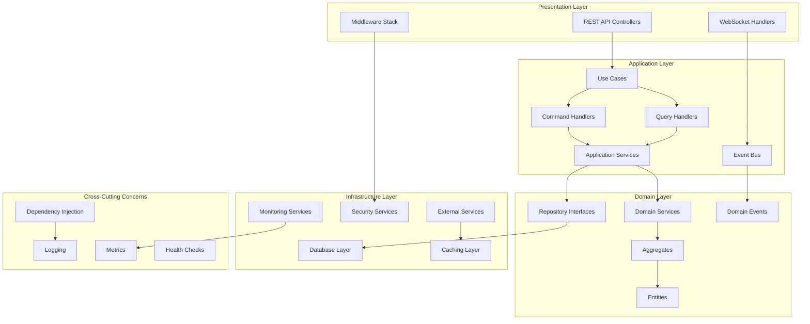
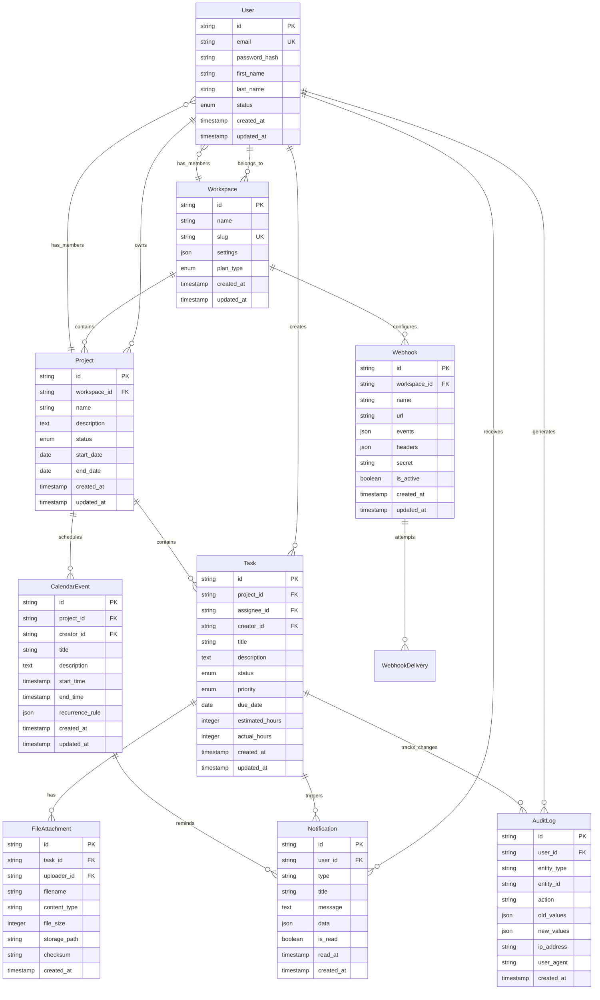

# Project Finalization Design Document

## Overview

This design document outlines the comprehensive approach to finalizing the Unified Enterprise Platform. The design addresses document consolidation, missing implementations, system integration, and production readiness features to transform the current development-stage application into a robust, scalable enterprise platform.

## Architecture

### Current State Analysis

The project follows a clean architecture pattern with the following layers:

- **Domain Layer**: Contains business logic, entities, aggregates, and domain services
- **Application Layer**: Contains use cases, command/query handlers, and application services
- **Infrastructure Layer**: Contains external service integrations, database access, and cross-cutting concerns
- **Presentation Layer**: Contains controllers, DTOs, middleware, and API routes

### Target Architecture Enhancements



## Components and Interfaces

### 1. Document Consolidation Strategy

#### Duplicate File Resolution Matrix

| Original File              | Enhanced File                         | Action         | Reason                                                    |
| -------------------------- | ------------------------------------- | -------------- | --------------------------------------------------------- |
| `task-use-cases.ts`        | `enhanced-task-use-cases.ts`          | Merge & Rename | Enhanced version has better orchestration                 |
| `email-service.ts`         | `enhanced-email-service.ts`           | Merge & Rename | Enhanced version has circuit breaker & multiple providers |
| `websocket-handler.ts`     | `enhanced-websocket-handler.ts`       | Merge & Rename | Enhanced version has better error handling                |
| `rate-limit-middleware.ts` | `enhanced-rate-limiter-middleware.ts` | Merge & Rename | Enhanced version has distributed rate limiting            |
| `monitoring services`      | `comprehensive-monitoring.ts`         | Consolidate    | Multiple monitoring files need single interface           |

#### Consolidation Process

1. **Analysis Phase**: Compare functionality between original and enhanced versions
2. **Merge Phase**: Combine best features from both implementations
3. **Rename Phase**: Use standard naming conventions (remove "enhanced" prefix)
4. **Update Phase**: Update all import statements across the project
5. **Validation Phase**: Ensure TypeScript compilation and functionality

### 2. Missing Infrastructure Components

#### Database Layer Completeness

**Missing Repository Implementations:**

```typescript
interface RepositoryCompletionPlan {
  // Core missing repositories
  NotificationRepository: {
    interface: 'INotificationRepository';
    implementation: 'NotificationRepository';
    schema: 'notifications.ts';
  };
  AuditLogRepository: {
    interface: 'IAuditLogRepository';
    implementation: 'AuditLogRepository';
    schema: 'audit-logs.ts';
  };
  WebhookRepository: {
    interface: 'IWebhookRepository';
    implementation: 'WebhookRepository';
    schema: 'webhooks.ts';
  };
  CalendarEventRepository: {
    interface: 'ICalendarEventRepository';
    implementation: 'CalendarEventRepository';
    schema: 'calendar-events.ts';
  };
  FileAttachmentRepository: {
    interface: 'IFileAttachmentRepository';
    implementation: 'FileAttachmentRepository';
    schema: 'file-attachments.ts';
  };
}
```

**Missing Schema Definitions:**

- Notifications schema with proper indexing for user queries
- Audit logs schema with time-series optimization
- Webhooks schema with delivery status tracking
- Calendar events schema with recurrence support
- File attachments schema with metadata and versioning

#### Application Layer Gaps

**Missing Application Services:**

```typescript
interface ApplicationServicePlan {
  AuthApplicationService: {
    responsibilities: ['session management', 'OAuth integration', '2FA'];
    dependencies: ['UserRepository', 'SessionManager', 'OAuthService'];
  };
  ProjectApplicationService: {
    responsibilities: ['project lifecycle', 'team management', 'permissions'];
    dependencies: [
      'ProjectRepository',
      'UserRepository',
      'NotificationService',
    ];
  };
  WorkspaceApplicationService: {
    responsibilities: ['tenant isolation', 'billing', 'user limits'];
    dependencies: ['WorkspaceRepository', 'BillingService', 'AuditService'];
  };
  WebhookApplicationService: {
    responsibilities: ['webhook delivery', 'retry logic', 'security'];
    dependencies: ['WebhookRepository', 'HttpClient', 'SecurityService'];
  };
}
```

**Missing Query Handlers:**

- NotificationQueryHandlers: GetNotifications, GetNotificationPreferences
- ProjectQueryHandlers: GetProject, ListProjects, GetProjectMembers
- UserQueryHandlers: GetUser, ListUsers, GetUserPreferences
- WorkspaceQueryHandlers: GetWorkspace, ListWorkspaces, GetWorkspaceStats
- WebhookQueryHandlers: GetWebhook, ListWebhooks, GetWebhookDeliveries

### 3. System Integration Architecture

#### Dependency Injection Enhancement

```typescript
interface EnhancedDIContainer {
  // Service registration with lifecycle management
  registerTransient<T>(token: string, factory: ServiceFactory<T>): void;
  registerScoped<T>(token: string, factory: ServiceFactory<T>): void;
  registerSingleton<T>(token: string, factory: ServiceFactory<T>): void;

  // Advanced features
  registerConditional<T>(
    token: string,
    condition: Predicate,
    factory: ServiceFactory<T>
  ): void;
  registerDecorator<T>(token: string, decorator: ServiceDecorator<T>): void;

  // Health and diagnostics
  validateConfiguration(): ValidationResult;
  getDependencyGraph(): DependencyGraph;
  getServiceHealth(): ServiceHealthStatus[];
}
```

#### Event System Integration

```typescript
interface EventSystemDesign {
  DomainEventBus: {
    publish: (event: DomainEvent) => Promise<void>;
    subscribe: (eventType: string, handler: EventHandler) => void;
    unsubscribe: (eventType: string, handler: EventHandler) => void;
  };

  ApplicationEventBus: {
    publishAsync: (event: ApplicationEvent) => Promise<void>;
    publishSync: (event: ApplicationEvent) => void;
    subscribeToPattern: (pattern: string, handler: EventHandler) => void;
  };

  IntegrationEventBus: {
    publishExternal: (event: IntegrationEvent) => Promise<void>;
    subscribeExternal: (source: string, handler: EventHandler) => void;
    configureRetryPolicy: (policy: RetryPolicy) => void;
  };
}
```

### 4. Production Readiness Features

#### Monitoring and Observability

```typescript
interface MonitoringArchitecture {
  HealthChecks: {
    database: DatabaseHealthCheck;
    cache: CacheHealthCheck;
    externalServices: ExternalServiceHealthCheck[];
    customChecks: CustomHealthCheck[];
  };

  Metrics: {
    applicationMetrics: ApplicationMetricsCollector;
    businessMetrics: BusinessMetricsCollector;
    infrastructureMetrics: InfrastructureMetricsCollector;
    customMetrics: CustomMetricsCollector;
  };

  Logging: {
    structuredLogging: StructuredLogger;
    correlationIds: CorrelationIdManager;
    logAggregation: LogAggregationService;
    alerting: AlertingService;
  };

  Tracing: {
    distributedTracing: DistributedTracingService;
    performanceMonitoring: PerformanceMonitor;
    errorTracking: ErrorTrackingService;
  };
}
```

#### Security Architecture

```typescript
interface SecurityArchitecture {
  Authentication: {
    jwtService: JWTService;
    sessionManager: SessionManager;
    oauthService: OAuthService;
    twoFactorAuth: TwoFactorAuthService;
  };

  Authorization: {
    rbacService: RBACService;
    permissionService: PermissionService;
    resourceGuards: ResourceGuard[];
  };

  DataProtection: {
    encryptionService: EncryptionService;
    hashingService: HashingService;
    dataAnonymization: DataAnonymizationService;
  };

  SecurityMiddleware: {
    rateLimiting: RateLimitingMiddleware;
    inputSanitization: InputSanitizationMiddleware;
    csrfProtection: CSRFProtectionMiddleware;
    corsConfiguration: CORSMiddleware;
  };
}
```

#### Performance Optimization

```typescript
interface PerformanceArchitecture {
  Caching: {
    distributedCache: DistributedCacheService;
    localCache: LocalCacheService;
    cacheInvalidation: CacheInvalidationStrategy;
    cacheWarming: CacheWarmingService;
  };

  DatabaseOptimization: {
    connectionPooling: ConnectionPoolManager;
    queryOptimization: QueryOptimizer;
    indexManagement: IndexManager;
    readReplicas: ReadReplicaManager;
  };

  APIOptimization: {
    responseCompression: CompressionMiddleware;
    requestBatching: RequestBatchingService;
    responseStreaming: StreamingService;
    apiVersioning: APIVersioningService;
  };
}
```

## Data Models

### Enhanced Entity Relationships



### Database Schema Optimization

#### Indexing Strategy

```sql
-- Performance-critical indexes
CREATE INDEX CONCURRENTLY idx_tasks_assignee_status ON tasks(assignee_id, status) WHERE status != 'COMPLETED';
CREATE INDEX CONCURRENTLY idx_tasks_project_due_date ON tasks(project_id, due_date) WHERE due_date IS NOT NULL;
CREATE INDEX CONCURRENTLY idx_notifications_user_unread ON notifications(user_id, created_at) WHERE is_read = false;
CREATE INDEX CONCURRENTLY idx_audit_logs_entity ON audit_logs(entity_type, entity_id, created_at);
CREATE INDEX CONCURRENTLY idx_webhooks_workspace_active ON webhooks(workspace_id) WHERE is_active = true;

-- Full-text search indexes
CREATE INDEX CONCURRENTLY idx_tasks_search ON tasks USING gin(to_tsvector('english', title || ' ' || description));
CREATE INDEX CONCURRENTLY idx_projects_search ON projects USING gin(to_tsvector('english', name || ' ' || description));
```

## Error Handling

### Comprehensive Error Architecture

```typescript
interface ErrorHandlingStrategy {
  DomainErrors: {
    ValidationError: BusinessRuleViolation;
    AuthorizationError: InsufficientPermissions;
    NotFoundError: ResourceNotFound;
    ConflictError: ResourceConflict;
  };

  InfrastructureErrors: {
    DatabaseError: DatabaseConnectionFailure | QueryExecutionFailure;
    ExternalServiceError: ServiceUnavailable | ServiceTimeout;
    CacheError: CacheConnectionFailure | CacheOperationFailure;
  };

  ApplicationErrors: {
    ValidationError: InputValidationFailure;
    ProcessingError: BusinessProcessFailure;
    IntegrationError: ExternalIntegrationFailure;
  };

  ErrorHandling: {
    globalErrorHandler: GlobalErrorHandler;
    errorLogger: ErrorLogger;
    errorReporter: ErrorReporter;
    errorRecovery: ErrorRecoveryService;
  };
}
```

### Error Response Format

```typescript
interface StandardErrorResponse {
  error: {
    code: string;
    message: string;
    details?: Record<string, any>;
    timestamp: string;
    traceId: string;
    path: string;
  };
  meta?: {
    requestId: string;
    version: string;
  };
}
```

## Testing Strategy

### Multi-Layer Testing Approach

```typescript
interface TestingStrategy {
  UnitTests: {
    domainLogic: DomainEntityTests | DomainServiceTests;
    applicationServices: ApplicationServiceTests;
    infrastructureServices: InfrastructureServiceTests;
    utilities: UtilityFunctionTests;
  };

  IntegrationTests: {
    databaseIntegration: RepositoryIntegrationTests;
    externalServiceIntegration: ExternalServiceIntegrationTests;
    eventHandling: EventHandlingIntegrationTests;
    caching: CacheIntegrationTests;
  };

  EndToEndTests: {
    apiEndpoints: APIEndpointTests;
    userWorkflows: UserWorkflowTests;
    businessProcesses: BusinessProcessTests;
    performanceTests: PerformanceTests;
  };

  QualityGates: {
    codeCoverage: MinimumCoverageThreshold;
    performanceBenchmarks: PerformanceBenchmarks;
    securityScans: SecurityScanResults;
    dependencyAudits: DependencyAuditResults;
  };
}
```

### Test Data Management

```typescript
interface TestDataStrategy {
  TestFixtures: {
    userFixtures: UserTestData[];
    projectFixtures: ProjectTestData[];
    taskFixtures: TaskTestData[];
    workspaceFixtures: WorkspaceTestData[];
  };

  DatabaseSeeding: {
    testDatabaseSetup: TestDatabaseSetup;
    dataSeeding: TestDataSeeder;
    dataCleanup: TestDataCleanup;
    transactionalTests: TransactionalTestSupport;
  };

  MockServices: {
    externalServiceMocks: ExternalServiceMock[];
    databaseMocks: DatabaseMock;
    cacheMocks: CacheMock;
    eventBusMocks: EventBusMock;
  };
}
```

## Deployment Architecture

### Production Deployment Strategy

```typescript
interface DeploymentArchitecture {
  Infrastructure: {
    containerization: DockerConfiguration;
    orchestration: KubernetesConfiguration;
    loadBalancing: LoadBalancerConfiguration;
    autoScaling: AutoScalingConfiguration;
  };

  DatabaseDeployment: {
    primaryDatabase: PostgreSQLConfiguration;
    readReplicas: ReadReplicaConfiguration;
    connectionPooling: ConnectionPoolConfiguration;
    backupStrategy: BackupConfiguration;
  };

  CacheDeployment: {
    redisCluster: RedisClusterConfiguration;
    cacheStrategy: CacheStrategyConfiguration;
    sessionStore: SessionStoreConfiguration;
  };

  MonitoringDeployment: {
    metricsCollection: PrometheusConfiguration;
    logAggregation: ElasticsearchConfiguration;
    alerting: AlertManagerConfiguration;
    dashboards: GrafanaConfiguration;
  };
}
```

### Environment Configuration

```typescript
interface EnvironmentConfiguration {
  Development: {
    database: LocalPostgreSQLConfig;
    cache: LocalRedisConfig;
    externalServices: MockServiceConfig;
    logging: VerboseLoggingConfig;
  };

  Staging: {
    database: StagingDatabaseConfig;
    cache: StagingRedisConfig;
    externalServices: StagingServiceConfig;
    logging: StandardLoggingConfig;
  };

  Production: {
    database: ProductionDatabaseConfig;
    cache: ProductionRedisConfig;
    externalServices: ProductionServiceConfig;
    logging: ProductionLoggingConfig;
    security: ProductionSecurityConfig;
  };
}
```

This design provides a comprehensive blueprint for transforming the current project into a production-ready enterprise platform with proper architecture, complete implementations, and robust operational capabilities.
