# TypeScript Error Resolution Design Document

## Overview

This design document outlines a comprehensive, systematic approach to resolving TypeScript errors throughout the Unified Enterprise Platform project. The strategy follows a strict bottom-up methodology, processing files in dependency order to prevent cascading errors and ensure each layer builds upon a solid, error-free foundation.

## Architecture

### Bottom-Up Resolution Strategy

The resolution strategy is built on the principle that TypeScript errors must be resolved in dependency order, starting from the most foundational components and working upward through the architectural layers.

```mermaid
graph TB
    subgraph "Phase 1: Foundation"
        CONFIG[Configuration Files]
        SHARED[Shared Types & Constants]
        ERRORS[Error Hierarchy]
    end

    subgraph "Phase 2: Domain Layer"
        VO[Value Objects]
        EVENTS[Domain Events]
        ENTITIES[Entities]
        SERVICES[Domain Services]
        REPOS[Repository Interfaces]
        AGGREGATES[Aggregates]
    end

    subgraph "Phase 3: Application Layer"
        CQRS[CQRS Infrastructure]
        COMMANDS[Commands & Queries]
        HANDLERS[Command/Query Handlers]
        APPSERVICES[Application Services]
    end

    subgraph "Phase 4: Infrastructure Layer"
        SCHEMA[Database Schema]
        REPOIMPL[Repository Implementations]
        EXTERNAL[External Services]
        CACHING[Caching Services]
        SECURITY[Security Services]
    end

    subgraph "Phase 5: Presentation Layer"
        DTOS[DTOs & Validation]
        CONTROLLERS[Controllers]
        MIDDLEWARE[Middleware]
        ROUTES[Routes]
    end

    subgraph "Phase 6: Integration"
        BOOTSTRAP[Application Bootstrap]
        DI[Dependency Injection]
        TESTS[Test Infrastructure]
    end

    CONFIG --> SHARED
    SHARED --> ERRORS
    ERRORS --> VO
    VO --> EVENTS
    EVENTS --> ENTITIES
    ENTITIES --> SERVICES
    SERVICES --> REPOS
    REPOS --> AGGREGATES
    AGGREGATES --> CQRS
    CQRS --> COMMANDS
    COMMANDS --> HANDLERS
    HANDLERS --> APPSERVICES
    APPSERVICES --> SCHEMA
    SCHEMA --> REPOIMPL
    REPOIMPL --> EXTERNAL
    EXTERNAL --> CACHING
    CACHING --> SECURITY
    SECURITY --> DTOS
    DTOS --> CONTROLLERS
    CONTROLLERS --> MIDDLEWARE
    MIDDLEWARE --> ROUTES
    ROUTES --> BOOTSTRAP
    BOOTSTRAP --> DI
    DI --> TESTS
```



### Error Resolution Methodology

#### Core Principles

1. **Dependency-First Resolution**: Always resolve dependencies before dependents
2. **Layer Isolation**: Complete one layer entirely before moving to the next
3. **Incremental Validation**: Validate each file/component immediately after fixing
4. **Type Safety First**: Prioritize strong typing over quick fixes
5. **Regression Prevention**: Implement validation gates to prevent error reoccurrence

#### File Processing Order Template

For each layer, files must be processed in this strict order:

1. **Base/Abstract Classes First** - These are inherited by other classes
2. **Interface Definitions** - These define contracts used by implementations
3. **Implementation Classes** - These implement interfaces and extend base classes
4. **Index Files Last** - These export everything and depend on all other files

## Components and Interfaces

### Phase 1: Foundation Layer Resolution

#### 1.1 Configuration Foundation

**Critical Priority - Execute First**

```typescript
interface ConfigurationResolutionPlan {
  files: {
    'tsconfig.json': {
      priority: 1;
      validations: [
        'compiler options',
        'path mappings',
        'include/exclude patterns',
      ];
      successCriteria: 'Valid TypeScript configuration with strict mode enabled';
    };
    '.eslintrc.js': {
      priority: 2;
      validations: ['TypeScript parser integration', 'rule compatibility'];
      successCriteria: 'ESLint TypeScript integration working without conflicts';
    };
    'vitest.config.ts': {
      priority: 3;
      validations: ['TypeScript test configuration', 'path resolution'];
      successCriteria: 'Test framework TypeScript integration functional';
    };
    'drizzle.config.ts': {
      priority: 4;
      validations: ['Database ORM TypeScript setup', 'schema generation'];
      successCriteria: 'Drizzle ORM TypeScript configuration error-free';
    };
  };
  validationCommand: 'tsc --noEmit tsconfig.json .eslintrc.js vitest.config.ts drizzle.config.ts';
}
```

#### 1.2 Shared Types Foundation

**Processing Order (Exact Sequence)**

```typescript
interface SharedTypesResolutionPlan {
  processingOrder: [
    // Step 1: Core types (used everywhere)
    'src/shared/types/common.types.ts',

    // Step 2: Interface definitions
    'src/shared/types/event.interface.ts',
    'src/shared/types/logger.interface.ts',
    'src/shared/types/validator.interface.ts',

    // Step 3: Export aggregation (LAST)
    'src/shared/types/index.ts',
  ];

  validationStrategy: {
    perFile: 'tsc --noEmit [specific-file]';
    layerComplete: 'tsc --noEmit src/shared/types/**/*.ts';
  };

  typeDefinitionRequirements: {
    strictNullChecks: true;
    noImplicitAny: true;
    noImplicitReturns: true;
    exactOptionalPropertyTypes: true;
  };
}
```

#### 1.3 Enums and Constants Foundation

```typescript
interface EnumsConstantsResolutionPlan {
  enumsProcessingOrder: [
    'src/shared/enums/common.enums.ts', // FIRST - used in types
    'src/shared/enums/index.ts', // LAST - exports all
  ];

  constantsProcessingOrder: [
    'src/shared/constants/error-constants.ts', // FIRST - used in errors
    'src/shared/constants/application-constants.ts',
    'src/shared/constants/project-constants.ts',
    'src/shared/constants/task-constants.ts',
    'src/shared/constants/user-constants.ts',
    'src/shared/constants/workspace-constants.ts',
    'src/shared/constants/index.ts', // LAST - exports all
  ];

  typeRequirements: {
    enums: 'Proper TypeScript enum syntax with explicit values';
    constants: 'Const assertions and proper type annotations';
    exports: 'Named exports with type information preserved';
  };
}
```

#### 1.4 Error Hierarchy Foundation

```typescript
interface ErrorHierarchyResolutionPlan {
  processingOrder: [
    'src/shared/errors/app-error.ts', // BASE - inherited by others
    'src/shared/errors/domain-error.ts', // inherits from app-error
    'src/shared/errors/infrastructure-error.ts', // inherits from app-error
    'src/shared/errors/validation-error.ts', // inherits from app-error
    'src/shared/errors/authorization-error.ts', // inherits from app-error
    'src/shared/errors/not-found-error.ts', // inherits from app-error
    'src/shared/errors/index.ts', // exports all errors
  ];

  inheritanceRequirements: {
    baseClass: {
      extends: 'Error';
      properties: ['name', 'message', 'stack', 'code', 'statusCode'];
      methods: ['toJSON', 'toString'];
    };
    derivedClasses: {
      extends: 'AppError';
      properConstructorChaining: true;
      propertyTypeAnnotations: true;
    };
  };

  validationCriteria: 'Error inheritance chain works flawlessly with TypeScript';
}
```

### Phase 2: Domain Layer Resolution

#### 2.1 Value Objects Resolution

```typescript
interface ValueObjectsResolutionPlan {
  processingOrder: [
    'src/domain/value-objects/value-object.ts', // BASE - inherited by all
    'src/domain/value-objects/user-id.ts',
    'src/domain/value-objects/workspace-id.ts',
    'src/domain/value-objects/project-id.ts',
    'src/domain/value-objects/task-id.ts',
    'src/domain/value-objects/notification-id.ts',
    'src/domain/value-objects/account-id.ts',
    'src/domain/value-objects/device-id.ts',
    'src/domain/value-objects/email.ts',
    'src/domain/value-objects/priority.ts',
    'src/domain/value-objects/user-status.ts',
    'src/domain/value-objects/task-status.ts',
    'src/domain/value-objects/project-status.ts',
    'src/domain/value-objects/project-role.ts',
    'src/domain/value-objects/index.ts',
  ];

  valueObjectPattern: {
    immutability: 'readonly properties with private constructor';
    equality: 'proper equals() method with type guards';
    validation: 'constructor validation with TypeScript guards';
    serialization: 'toValue() and fromValue() static methods';
  };

  typeRequirements: {
    baseClass: 'abstract class with generic type parameter';
    implementations: 'proper extension with type safety';
    noAnyTypes: 'strict typing throughout value object hierarchy';
  };
}
```

#### 2.2 Domain Events Resolution

```typescript
interface DomainEventsResolutionPlan {
  processingOrder: [
    'src/domain/events/domain-event.ts', // BASE interface
    'src/domain/events/domain-event-publisher.ts', // infrastructure
    'src/domain/events/user-events.ts',
    'src/domain/events/workspace-events.ts',
    'src/domain/events/project-events.ts',
    'src/domain/events/task-events.ts',
    'src/domain/events/notification-events.ts',
    'src/domain/events/webhook-events.ts',
    'src/domain/events/calendar-events.ts',
    'src/domain/events/audit-events.ts',
    'src/domain/events/index.ts',
  ];

  eventSystemDesign: {
    baseInterface: {
      properties: [
        'eventId',
        'eventType',
        'aggregateId',
        'occurredOn',
        'eventVersion',
      ];
      genericSupport: 'DomainEvent<TData>';
      serialization: 'JSON serializable data payload';
    };
    eventPublisher: {
      methods: ['publish', 'publishAll', 'subscribe', 'unsubscribe'];
      asyncSupport: 'Promise-based event publishing';
      errorHandling: 'proper error propagation with types';
    };
  };

  validationCriteria: 'Strongly typed event system with proper interfaces';
}
```

#### 2.3 Entities Resolution

```typescript
interface EntitiesResolutionPlan {
  processingOrder: [
    'src/domain/entities/base-entity.ts', // BASE - inherited by all
    'src/domain/entities/user.ts', // fundamental entity
    'src/domain/entities/workspace.ts', // depends on user
    'src/domain/entities/project.ts', // depends on workspace, user
    'src/domain/entities/task.ts', // depends on project, user
    'src/domain/entities/notification.ts',
    'src/domain/entities/webhook.ts',
    'src/domain/entities/calendar-event.ts',
    'src/domain/entities/file-attachment.ts',
    'src/domain/entities/device.ts',
    'src/domain/entities/account.ts',
    'src/domain/entities/activity-tracking.ts',
    'src/domain/entities/audit-log.ts',
    'src/domain/entities/metrics.ts',
    'src/domain/entities/index.ts',
  ];

  entityDesignPattern: {
    baseEntity: {
      properties: ['id', 'createdAt', 'updatedAt'];
      methods: ['equals', 'hashCode', 'domainEvents'];
      eventSupport: 'domain event raising and clearing';
    };
    concreteEntities: {
      valueObjectUsage: 'use value objects instead of primitives';
      businessLogic: 'encapsulated domain logic methods';
      invariantEnforcement: 'proper validation and business rules';
    };
  };

  typeRequirements: {
    strongTyping: 'no any types, proper generic constraints';
    valueObjectIntegration: 'entities use value objects for domain concepts';
    relationshipModeling: 'proper TypeScript references between entities';
  };
}
```

#### 2.4 Repository Interfaces Resolution

```typescript
interface RepositoryInterfacesResolutionPlan {
  processingOrder: [
    'src/domain/repositories/base-repository.interface.ts',
    'src/domain/repositories/user-repository.interface.ts',
    'src/domain/repositories/workspace-repository.interface.ts',
    'src/domain/repositories/project-repository.interface.ts',
    'src/domain/repositories/task-repository.interface.ts',
    'src/domain/repositories/notification-repository.interface.ts',
    'src/domain/repositories/webhook-repository.interface.ts',
    'src/domain/repositories/calendar-event-repository.interface.ts',
    'src/domain/repositories/file-attachment-repository.interface.ts',
    'src/domain/repositories/audit-log-repository.interface.ts',
    'src/domain/repositories/index.ts',
  ];

  repositoryContractDesign: {
    baseInterface: {
      genericSupport: 'IRepository<TEntity, TId>';
      crudOperations: ['findById', 'save', 'delete', 'exists'];
      querySupport: ['findBy', 'findAll', 'count'];
      asyncPatterns: 'Promise-based return types';
    };
    concreteInterfaces: {
      domainSpecificMethods: 'business-specific query methods';
      bulkOperations: 'batch operations for efficiency';
      transactionSupport: 'transaction context parameters';
    };
  };

  validationCriteria: 'Clean repository contracts ready for implementation';
}
```

### Phase 3: Application Layer Resolution

#### 3.1 CQRS Infrastructure Resolution

```typescript
interface CQRSInfrastructureResolutionPlan {
  processingOrder: [
    'src/application/cqrs/command.ts', // interface
    'src/application/cqrs/query.ts', // interface
    'src/application/cqrs/command-bus.ts',
    'src/application/cqrs/query-bus.ts',
    'src/application/cqrs/cqrs-factory.ts',
    'src/application/cqrs/validation/command-validator.ts',
    'src/application/cqrs/validation/query-validator.ts',
    'src/application/cqrs/index.ts',
  ];

  cqrsDesignPattern: {
    commandInterface: {
      baseInterface: 'ICommand';
      properties: ['commandId', 'timestamp', 'userId'];
      validation: 'built-in validation support';
    };
    queryInterface: {
      baseInterface: 'IQuery<TResult>';
      properties: ['queryId', 'timestamp', 'userId'];
      resultTyping: 'strongly typed query results';
    };
    busImplementation: {
      handlerRegistration: 'type-safe handler registration';
      middlewareSupport: 'pipeline middleware integration';
      errorHandling: 'comprehensive error handling with types';
    };
  };

  validationCriteria: 'Strongly typed CQRS infrastructure with proper generics';
}
```

#### 3.2 Commands and Queries Resolution

```typescript
interface CommandsQueriesResolutionPlan {
  commandsProcessingOrder: [
    'src/application/commands/base-command.ts',
    'src/application/commands/user-commands.ts',
    'src/application/commands/workspace-commands.ts',
    'src/application/commands/project-commands.ts',
    'src/application/commands/task-commands.ts',
    'src/application/commands/notification-commands.ts',
    'src/application/commands/webhook-commands.ts',
    'src/application/commands/calendar-commands.ts',
    'src/application/commands/audit-commands.ts',
    'src/application/commands/index.ts',
  ];

  queriesProcessingOrder: [
    'src/application/queries/base-query.ts',
    'src/application/queries/user-queries.ts',
    'src/application/queries/workspace-queries.ts',
    'src/application/queries/project-queries.ts',
    'src/application/queries/task-queries.ts',
    'src/application/queries/notification-queries.ts',
    'src/application/queries/webhook-queries.ts',
    'src/application/queries/calendar-queries.ts',
    'src/application/queries/audit-queries.ts',
    'src/application/queries/index.ts',
  ];

  designRequirements: {
    immutability: 'readonly properties for command/query objects';
    validation: 'proper validation decorators with TypeScript';
    dtoMapping: 'proper mapping to/from DTOs with type safety';
  };
}
```

#### 3.3 Handlers Resolution

```typescript
interface HandlersResolutionPlan {
  processingOrder: [
    'src/application/handlers/base-handler.ts', // FIRST
    'src/application/handlers/user-command-handlers.ts',
    'src/application/handlers/user-query-handlers.ts',
    'src/application/handlers/workspace-command-handlers.ts',
    'src/application/handlers/workspace-query-handlers.ts',
    'src/application/handlers/project-command-handlers.ts',
    'src/application/handlers/project-query-handlers.ts',
    'src/application/handlers/task-command-handlers.ts',
    'src/application/handlers/task-query-handlers.ts',
    'src/application/handlers/notification-command-handlers.ts',
    'src/application/handlers/notification-query-handlers.ts',
    'src/application/handlers/webhook-command-handlers.ts',
    'src/application/handlers/webhook-query-handlers.ts',
    'src/application/handlers/calendar-command-handlers.ts',
    'src/application/handlers/calendar-query-handlers.ts',
    'src/application/handlers/audit-log-command-handlers.ts',
    'src/application/handlers/audit-log-query-handlers.ts',
    'src/application/handlers/index.ts',
  ];

  handlerDesignPattern: {
    baseHandler: {
      interface: 'IHandler<TRequest, TResponse>';
      methods: ['handle', 'validate'];
      dependencyInjection: 'constructor injection with interfaces';
    };
    concreteHandlers: {
      domainServiceUsage: 'proper integration with domain services';
      repositoryUsage: 'proper repository interface usage';
      transactionManagement: 'transaction boundary management';
      errorHandling: 'domain error handling and propagation';
    };
  };

  validationCriteria: 'All handlers work with proper domain integration';
}
```

### Phase 4: Infrastructure Layer Resolution

#### 4.1 Database Schema Resolution

```typescript
interface DatabaseSchemaResolutionPlan {
  processingOrder: [
    'src/infrastructure/database/schema/users.ts', // FIRST - referenced by others
    'src/infrastructure/database/schema/workspaces.ts',
    'src/infrastructure/database/schema/projects.ts',
    'src/infrastructure/database/schema/project-members.ts',
    'src/infrastructure/database/schema/tasks.ts',
    'src/infrastructure/database/schema/task-dependencies.ts',
    'src/infrastructure/database/schema/notifications.ts',
    'src/infrastructure/database/schema/webhooks.ts',
    'src/infrastructure/database/schema/calendar-events.ts',
    'src/infrastructure/database/schema/file-attachments.ts',
    'src/infrastructure/database/schema/audit-logs.ts',
    'src/infrastructure/database/schema/index.ts',
  ];

  drizzleIntegration: {
    schemaDefinition: {
      tableDefinitions: 'proper Drizzle table syntax';
      relationshipDefinitions: 'foreign key relationships with proper typing';
      indexDefinitions: 'performance indexes with proper syntax';
      constraintDefinitions: 'database constraints with type safety';
    };
    typeGeneration: {
      inferredTypes: 'proper type inference from schema';
      selectTypes: 'generated select types for queries';
      insertTypes: 'generated insert types for mutations';
    };
  };

  validationCriteria: 'Perfect schema-entity alignment with type safety';
}
```

#### 4.2 Repository Implementations Resolution

```typescript
interface RepositoryImplementationsResolutionPlan {
  processingOrder: [
    'src/infrastructure/database/repositories/base-drizzle-repository.ts', // FIRST
    'src/infrastructure/database/repositories/user-repository.ts',
    'src/infrastructure/database/repositories/workspace-repository.ts',
    'src/infrastructure/database/repositories/project-repository.ts',
    'src/infrastructure/database/repositories/task-repository.ts',
    'src/infrastructure/database/repositories/notification-repository.ts',
    'src/infrastructure/database/repositories/webhook-repository.ts',
    'src/infrastructure/database/repositories/calendar-event-repository.ts',
    'src/infrastructure/database/repositories/file-attachment-repository.ts',
    'src/infrastructure/database/repositories/audit-log-repository.ts',
    'src/infrastructure/database/repositories/index.ts',
  ];

  implementationRequirements: {
    interfaceImplementation: 'exact implementation of domain interfaces';
    drizzleIntegration: 'proper Drizzle ORM query syntax';
    entityMapping: 'proper mapping between database models and domain entities';
    transactionSupport: 'transaction context handling';
    errorHandling: 'proper error handling and logging';
  };

  validationCriteria: 'Type-safe repositories with proper domain integration';
}
```

### Phase 5: Presentation Layer Resolution

#### 5.1 DTOs and Validation Resolution

```typescript
interface DTOsValidationResolutionPlan {
  processingOrder: [
    'src/presentation/dto/base-dto.ts', // FIRST
    'src/presentation/dto/error-dto.ts',
    'src/presentation/dto/user-dto.ts',
    'src/presentation/dto/workspace-dto.ts',
    'src/presentation/dto/project-dto.ts',
    'src/presentation/dto/task-dto.ts',
    'src/presentation/dto/notification-dto.ts',
    'src/presentation/dto/webhook-dto.ts',
    'src/presentation/dto/calendar-dto.ts',
    'src/presentation/dto/analytics-dto.ts',
    'src/presentation/dto/index.ts',
  ];

  dtoDesignPattern: {
    baseDTO: {
      validationFramework: 'integration with validation library';
      serializationSupport: 'JSON serialization/deserialization';
      typeTransformation: 'proper type transformation utilities';
    };
    concreteDTOs: {
      domainMapping: 'proper mapping to/from domain entities';
      validationDecorators: 'comprehensive validation rules';
      apiContractAdherence: 'consistent API contract implementation';
    };
  };

  validationCriteria: 'Type-safe DTOs with proper validation';
}
```

#### 5.2 Controllers Resolution

```typescript
interface ControllersResolutionPlan {
  processingOrder: [
    'src/presentation/controllers/base-controller.ts', // FIRST
    'src/presentation/controllers/auth-controller.ts',
    'src/presentation/controllers/user-controller.ts',
    'src/presentation/controllers/workspace-controller.ts',
    'src/presentation/controllers/project-controller.ts',
    'src/presentation/controllers/task-controller.ts',
    'src/presentation/controllers/notification-controller.ts',
    'src/presentation/controllers/webhook-controller.ts',
    'src/presentation/controllers/calendar-controller.ts',
    'src/presentation/controllers/analytics-controller.ts',
    'src/presentation/controllers/index.ts',
  ];

  controllerDesignPattern: {
    baseController: {
      fastifyIntegration: 'proper Fastify request/response typing';
      dependencyInjection: 'constructor injection of application services';
      errorHandling: 'standardized error response formatting';
    };
    concreteControllers: {
      routeHandlers: 'proper async/await patterns with type safety';
      parameterValidation: 'request parameter validation with TypeScript';
      responseFormatting: 'consistent response formatting';
      authorizationIntegration: 'proper authorization middleware integration';
    };
  };

  validationCriteria: 'Type-safe controllers with proper error handling';
}
```

### Phase 6: Integration Layer Resolution

#### 6.1 Application Bootstrap Resolution

```typescript
interface ApplicationBootstrapResolutionPlan {
  processingOrder: [
    'src/index.ts', // entry point
    'src/server.ts', // server setup
    'src/app.ts', // application setup
  ];

  bootstrapRequirements: {
    dependencyInjection: {
      containerSetup: 'proper DI container initialization';
      serviceRegistration: 'all services registered with correct lifetimes';
      dependencyResolution: 'circular dependency detection and resolution';
    };
    serverConfiguration: {
      fastifySetup: 'proper Fastify server configuration';
      middlewareRegistration: 'middleware pipeline setup';
      routeRegistration: 'all routes registered with proper typing';
      errorHandling: 'global error handling setup';
    };
    applicationLifecycle: {
      startupSequence: 'proper service initialization order';
      healthChecks: 'startup health validation';
      gracefulShutdown: 'proper cleanup on application shutdown';
    };
  };

  validationCriteria: 'Application starts without any TypeScript errors';
}
```

## Data Models

### TypeScript Configuration Optimization

```typescript
interface TypeScriptConfiguration {
  compilerOptions: {
    // Strict Type Checking
    strict: true;
    noImplicitAny: true;
    strictNullChecks: true;
    strictFunctionTypes: true;
    strictBindCallApply: true;
    strictPropertyInitialization: true;
    noImplicitReturns: true;
    noFallthroughCasesInSwitch: true;
    noUncheckedIndexedAccess: true;
    exactOptionalPropertyTypes: true;

    // Module Resolution
    moduleResolution: 'node';
    baseUrl: './';
    paths: {
      '@/*': ['src/*'];
      '@domain/*': ['src/domain/*'];
      '@application/*': ['src/application/*'];
      '@infrastructure/*': ['src/infrastructure/*'];
      '@presentation/*': ['src/presentation/*'];
      '@shared/*': ['src/shared/*'];
    };

    // Emit
    declaration: true;
    declarationMap: true;
    sourceMap: true;
    outDir: './dist';
    removeComments: false;

    // Interop Constraints
    esModuleInterop: true;
    allowSyntheticDefaultImports: true;
    forceConsistentCasingInFileNames: true;

    // Type Checking
    skipLibCheck: false;
    skipDefaultLibCheck: false;
  };

  include: ['src/**/*', 'tests/**/*', '*.ts', '*.js'];

  exclude: ['node_modules', 'dist', '**/*.spec.ts', '**/*.test.ts'];
}
```

### Error Classification System

```typescript
interface ErrorClassificationSystem {
  TypeScriptErrorCategories: {
    ConfigurationErrors: {
      description: 'Errors in TypeScript configuration files';
      examples: [
        'Invalid tsconfig.json',
        'Missing type definitions',
        'Path mapping issues',
      ];
      resolution: 'Fix configuration before proceeding with code';
    };

    TypeDefinitionErrors: {
      description: 'Missing or incorrect type definitions';
      examples: [
        'Implicit any types',
        'Missing interface definitions',
        'Incorrect generic constraints',
      ];
      resolution: 'Define proper types and interfaces';
    };

    InheritanceErrors: {
      description: 'Problems with class inheritance and interface implementation';
      examples: [
        'Missing method implementations',
        'Incorrect method signatures',
        'Abstract class issues',
      ];
      resolution: 'Fix inheritance hierarchy and method implementations';
    };

    ImportExportErrors: {
      description: 'Module import/export issues';
      examples: [
        'Circular dependencies',
        'Missing exports',
        'Incorrect import paths',
      ];
      resolution: 'Fix module structure and dependencies';
    };

    GenericTypeErrors: {
      description: 'Issues with generic type parameters and constraints';
      examples: [
        'Incorrect generic constraints',
        'Missing type parameters',
        'Generic type inference issues',
      ];
      resolution: 'Fix generic type definitions and usage';
    };
  };

  ResolutionPriority: {
    Critical: 'Blocks compilation entirely - must be fixed first';
    High: 'Causes cascading errors - fix before dependent files';
    Medium: 'Isolated errors - can be fixed in parallel';
    Low: 'Style/preference issues - fix after functionality';
  };
}
```

## Error Handling

### Systematic Error Resolution Process

```typescript
interface ErrorResolutionProcess {
  PreResolutionValidation: {
    backupCreation: 'Create git branch before starting resolution';
    dependencyAnalysis: 'Map file dependencies to determine processing order';
    errorCategorization: 'Classify errors by type and severity';
    toolValidation: 'Ensure TypeScript compiler and tools are properly configured';
  };

  PerFileResolutionProcess: {
    step1_IsolateFile: 'Process single file in isolation';
    step2_AnalyzeErrors: 'Identify all TypeScript errors in the file';
    step3_ResolveDependencies: 'Ensure all imported dependencies are error-free';
    step4_FixErrors: 'Resolve errors in order of dependency';
    step5_ValidateFile: 'Run tsc --noEmit on specific file';
    step6_ValidateLayer: 'Run tsc --noEmit on entire layer after file completion';
  };

  LayerCompletionValidation: {
    typeScriptCompilation: 'tsc --noEmit [layer-pattern]';
    eslintValidation: 'npx eslint [layer-pattern] --fix';
    testExecution: 'npm test -- [layer-test-pattern]';
    dependencyValidation: 'Ensure no circular dependencies introduced';
  };

  RegressionPrevention: {
    preCommitHooks: 'TypeScript validation before commits';
    ciValidation: 'Continuous integration TypeScript checks';
    incrementalValidation: "Validate changes don't break existing code";
    documentationUpdates: 'Update type documentation as needed';
  };
}
```

### Error Recovery Strategies

```typescript
interface ErrorRecoveryStrategies {
  CircularDependencyResolution: {
    detection: 'Use dependency analysis tools to identify cycles';
    resolution: 'Break cycles using dependency injection or interface segregation';
    validation: "Ensure resolution doesn't break functionality";
  };

  GenericTypeIssueResolution: {
    constraintDefinition: 'Define proper generic constraints';
    utilityTypeUsage: 'Use TypeScript utility types correctly';
    typeInference: 'Improve type inference with proper annotations';
  };

  ModuleResolutionIssues: {
    pathMapping: 'Fix TypeScript path mapping configuration';
    importStatements: 'Correct import/export statements';
    moduleStructure: 'Reorganize modules to eliminate conflicts';
  };

  InheritanceProblems: {
    abstractClassImplementation: 'Properly implement abstract methods';
    interfaceImplementation: 'Ensure all interface methods are implemented';
    methodSignatureMatching: 'Match method signatures exactly';
  };
}
```

## Testing Strategy

### Layer-by-Layer Validation Approach

```typescript
interface LayerValidationStrategy {
  FoundationLayerValidation: {
    configurationTests: 'Validate TypeScript configuration correctness';
    sharedTypesTests: 'Test type definitions and exports';
    errorHierarchyTests: 'Test error class inheritance and functionality';
    validationCommand: 'tsc --noEmit src/shared/**/*.ts';
  };

  DomainLayerValidation: {
    valueObjectTests: 'Test value object immutability and equality';
    entityTests: 'Test entity behavior and domain logic';
    domainServiceTests: 'Test domain service implementations';
    repositoryInterfaceTests: 'Validate repository contract definitions';
    validationCommand: 'tsc --noEmit src/domain/**/*.ts';
  };

  ApplicationLayerValidation: {
    cqrsTests: 'Test command/query bus functionality';
    handlerTests: 'Test command and query handler implementations';
    applicationServiceTests: 'Test application service orchestration';
    validationCommand: 'tsc --noEmit src/application/**/*.ts';
  };

  InfrastructureLayerValidation: {
    repositoryImplementationTests: 'Test repository implementations';
    externalServiceTests: 'Test external service integrations';
    databaseSchemaTests: 'Test database schema definitions';
    validationCommand: 'tsc --noEmit src/infrastructure/**/*.ts';
  };

  PresentationLayerValidation: {
    controllerTests: 'Test API controller implementations';
    dtoTests: 'Test DTO validation and serialization';
    middlewareTests: 'Test middleware functionality';
    validationCommand: 'tsc --noEmit src/presentation/**/*.ts';
  };

  IntegrationValidation: {
    bootstrapTests: 'Test application startup and dependency injection';
    endToEndTests: 'Test complete request/response cycles';
    performanceTests: 'Validate performance under TypeScript strict mode';
    validationCommand: 'tsc --noEmit && npm test && npm run build';
  };
}
```

### Quality Gates and Success Criteria

```typescript
interface QualityGatesDefinition {
  PhaseCompletionCriteria: {
    zeroTypeScriptErrors: 'tsc --noEmit must pass for phase scope';
    zeroESLintErrors: 'npx eslint must pass for phase scope';
    allTestsPassing: 'npm test must pass for completed components';
    noDependencyIssues: 'No circular dependencies or missing imports';
    buildSuccess: 'npm run build must complete without warnings';
  };

  FinalSuccessCriteria: {
    projectWideCompilation: 'tsc --noEmit passes for entire project';
    strictModeCompliance: 'All strict TypeScript settings enabled and passing';
    lintingCompliance: 'Zero ESLint errors project-wide';
    testSuiteSuccess: 'All tests pass without TypeScript errors';
    buildSuccess: 'Production build completes successfully';
    performanceValidation: 'No performance degradation from type checking';
  };

  RegressionPreventionMeasures: {
    preCommitValidation: 'Git hooks prevent commits with TypeScript errors';
    ciCdIntegration: 'Continuous integration enforces TypeScript validation';
    incrementalChecking: 'TypeScript incremental compilation for fast feedback';
    dependencyMonitoring: 'Monitor for dependency updates that break types';
  };
}
```

This comprehensive design provides a systematic, foolproof approach to resolving all TypeScript errors in the project while maintaining architectural integrity and preventing regression issues. The bottom-up methodology ensures that each layer builds upon a solid, error-free foundation.
