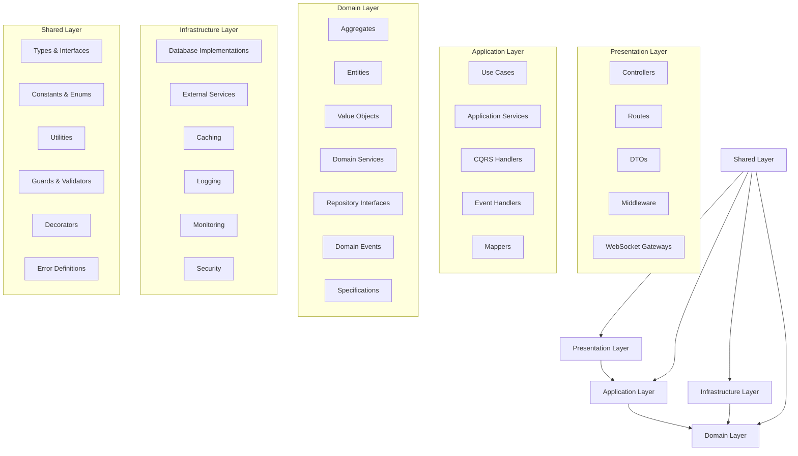

# Design Document

## Overview

The Unified Enterprise Platform restructure will transform the existing scattered codebase into a perfectly organized, enterprise-grade application following clean architecture and domain-driven design (DDD) principles. The design ensures each layer has clear responsibilities, dependencies flow in one direction, and all components are properly connected and optimized for high performance.

The restructure will maintain all existing domain functionality while eliminating duplications, inconsistencies, and layer violations. The result will be a cohesive system where each component operates as part of a unified, high-performance enterprise platform.

## Architecture

### Clean Architecture Layers

The system follows a strict 5-layer clean architecture:



### Domain Organization

The system preserves all existing domains while organizing them within the clean architecture:

- **Authentication Domain**: User management, sessions, MFA, security
- **Task Management Domain**: Tasks, projects, workspaces, teams
- **Calendar Domain**: Events, integrations, scheduling
- **Notification Domain**: Email, push, in-app notifications
- **Analytics Domain**: Metrics, reporting, insights
- **Audit Domain**: Activity tracking, compliance
- **Collaboration Domain**: Real-time editing, presence
- **Data Import/Export Domain**: Data migration, backups
- **Feedback Domain**: User feedback, surveys
- **File Management Domain**: File storage, processing
- **Real-time Domain**: WebSocket communications
- **Search Domain**: Full-text search, indexing
- **System Monitoring Domain**: Health checks, performance
- **Webhook Domain**: External integrations

## Components and Interfaces

### Presentation Layer Components

#### Controllers

```typescript
// Base controller pattern
export abstract class BaseController {
  protected readonly logger: ILogger;
  protected readonly validator: IValidator;

  constructor(logger: ILogger, validator: IValidator) {
    this.logger = logger;
    this.validator = validator;
  }

  protected async handleRequest<T>(
    request: FastifyRequest,
    reply: FastifyReply,
    handler: () => Promise<T>
  ): Promise<void> {
    try {
      const result = await handler();
      return reply.code(200).send({
        success: true,
        data: result,
      });
    } catch (error) {
      this.logger.error('Request failed', error);
      return this.handleError(reply, error);
    }
  }

  protected abstract handleError(reply: FastifyReply, error: Error): void;
}
```

#### Route Organization

```typescript
// Route registration pattern
export interface RouteModule {
  prefix: string;
  routes: FastifyPluginAsync;
}

export const authRoutes: RouteModule = {
  prefix: '/auth',
  routes: async fastify => {
    fastify.post('/login', authController.login);
    fastify.post('/register', authController.register);
    fastify.post('/logout', authController.logout);
  },
};
```

#### DTOs and Validation

```typescript
// Request/Response DTOs
export interface CreateTaskRequestDto {
  title: string;
  description?: string;
  projectId?: string;
  assigneeId?: string;
  dueDate?: string;
  priority: 'low' | 'medium' | 'high' | 'critical';
}

export interface TaskResponseDto {
  id: string;
  title: string;
  description?: string;
  status: string;
  priority: string;
  assignee?: UserResponseDto;
  createdAt: string;
  updatedAt: string;
}
```

### Application Layer Components

#### Use Cases

```typescript
// Use case pattern
export class CreateTaskUseCase {
  constructor(
    private readonly taskRepository: ITaskRepository,
    private readonly userRepository: IUserRepository,
    private readonly eventBus: IEventBus,
    private readonly logger: ILogger
  ) {}

  async execute(command: CreateTaskCommand): Promise<TaskDto> {
    // Validate command
    await this.validateCommand(command);

    // Create domain aggregate
    const task = Task.create({
      title: command.title,
      description: command.description,
      workspaceId: WorkspaceId.create(command.workspaceId),
      creatorId: UserId.create(command.creatorId),
      priority: Priority.create(command.priority),
    });

    // Persist aggregate
    await this.taskRepository.save(task);

    // Publish domain events
    await this.eventBus.publishAll(task.domainEvents);
    task.clearEvents();

    // Return DTO
    return TaskMapper.toDto(task);
  }

  private async validateCommand(command: CreateTaskCommand): Promise<void> {
    // Business validation logic
  }
}
```

#### Application Services

```typescript
// Application service pattern
export class TaskApplicationService {
  constructor(
    private readonly createTaskUseCase: CreateTaskUseCase,
    private readonly updateTaskUseCase: UpdateTaskUseCase,
    private readonly deleteTaskUseCase: DeleteTaskUseCase,
    private readonly getTaskQuery: GetTaskQuery,
    private readonly listTasksQuery: ListTasksQuery
  ) {}

  async createTask(command: CreateTaskCommand): Promise<TaskDto> {
    return await this.createTaskUseCase.execute(command);
  }

  async updateTask(command: UpdateTaskCommand): Promise<TaskDto> {
    return await this.updateTaskUseCase.execute(command);
  }

  async getTask(query: GetTaskQuery): Promise<TaskDto> {
    return await this.getTaskQuery.execute(query);
  }

  async listTasks(query: ListTasksQuery): Promise<PaginatedResponse<TaskDto>> {
    return await this.listTasksQuery.execute(query);
  }
}
```

#### CQRS Implementation

```typescript
// Command pattern
export abstract class Command {
  public readonly id: string;
  public readonly timestamp: Date;

  constructor() {
    this.id = generateId();
    this.timestamp = new Date();
  }
}

export class CreateTaskCommand extends Command {
  constructor(
    public readonly title: string,
    public readonly workspaceId: string,
    public readonly creatorId: string,
    public readonly description?: string,
    public readonly priority?: string
  ) {
    super();
  }
}

// Query pattern
export abstract class Query<TResult> {
  public readonly id: string;
  public readonly timestamp: Date;

  constructor() {
    this.id = generateId();
    this.timestamp = new Date();
  }
}

export class GetTaskQuery extends Query<TaskDto> {
  constructor(public readonly taskId: string) {
    super();
  }
}
```

### Domain Layer Components

#### Aggregates

```typescript
// Aggregate root pattern
export abstract class AggregateRoot<TProps> {
  private _domainEvents: DomainEvent[] = [];

  constructor(protected readonly props: TProps) {}

  get domainEvents(): DomainEvent[] {
    return [...this._domainEvents];
  }

  protected addDomainEvent(event: DomainEvent): void {
    this._domainEvents.push(event);
  }

  public clearEvents(): void {
    this._domainEvents = [];
  }

  protected abstract validate(): void;
  protected abstract applyBusinessRules(): void;
}

// Task aggregate implementation
export class TaskAggregate extends AggregateRoot<TaskProps> {
  private constructor(props: TaskProps) {
    super(props);
    this.validate();
    this.applyBusinessRules();
  }

  public static create(props: CreateTaskProps): TaskAggregate {
    const task = new TaskAggregate({
      ...props,
      id: TaskId.generate(),
      status: TaskStatus.todo(),
      createdAt: new Date(),
      updatedAt: new Date(),
    });

    task.addDomainEvent(
      new TaskCreatedEvent(task.id, task.title, task.creatorId)
    );
    return task;
  }

  public updateTitle(newTitle: string): void {
    if (!newTitle || newTitle.trim().length === 0) {
      throw new DomainError('Task title cannot be empty');
    }

    this.props.title = newTitle.trim();
    this.props.updatedAt = new Date();

    this.addDomainEvent(new TaskTitleUpdatedEvent(this.id, newTitle));
  }

  protected validate(): void {
    if (!this.props.title || this.props.title.trim().length === 0) {
      throw new DomainError('Task title is required');
    }

    if (this.props.title.length > 500) {
      throw new DomainError('Task title cannot exceed 500 characters');
    }
  }

  protected applyBusinessRules(): void {
    // Ensure creator is always a watcher
    if (!this.props.watchers.some(w => w.equals(this.props.creatorId))) {
      this.props.watchers.push(this.props.creatorId);
    }

    // Auto-set completion timestamp for completed tasks
    if (this.props.status.isCompleted() && !this.props.completedAt) {
      this.props.completedAt = new Date();
    }
  }
}
```

#### Value Objects

```typescript
// Value object pattern
export abstract class ValueObject<T> {
  protected readonly _value: T;

  constructor(value: T) {
    this.validate(value);
    this._value = value;
  }

  get value(): T {
    return this._value;
  }

  public equals(other: ValueObject<T>): boolean {
    return JSON.stringify(this._value) === JSON.stringify(other._value);
  }

  protected abstract validate(value: T): void;
}

// Task ID value object
export class TaskId extends ValueObject<string> {
  private constructor(value: string) {
    super(value);
  }

  public static create(value: string): TaskId {
    return new TaskId(value);
  }

  public static generate(): TaskId {
    return new TaskId(generateUuid());
  }

  protected validate(value: string): void {
    if (!value || value.trim().length === 0) {
      throw new DomainError('Task ID cannot be empty');
    }

    if (!isValidUuid(value)) {
      throw new DomainError('Task ID must be a valid UUID');
    }
  }
}
```

#### Domain Services

```typescript
// Domain service pattern
export class TaskDomainService {
  constructor(
    private readonly taskRepository: ITaskRepository,
    private readonly userRepository: IUserRepository
  ) {}

  async canUserCreateTask(
    userId: UserId,
    workspaceId: WorkspaceId
  ): Promise<boolean> {
    const user = await this.userRepository.findById(userId);
    if (!user) {
      return false;
    }

    // Business logic to determine if user can create tasks
    return user.hasPermissionInWorkspace(workspaceId, 'CREATE_TASK');
  }

  async calculateTaskPriority(task: TaskAggregate): Promise<Priority> {
    // Complex business logic for priority calculation
    let priority = task.priority;

    if (task.isOverdue()) {
      priority = Priority.high();
    }

    if (task.isBlockingOtherTasks()) {
      priority = Priority.critical();
    }

    return priority;
  }
}
```

### Infrastructure Layer Components

#### Repository Implementations

```typescript
// Repository implementation pattern
export class PrismaTaskRepository implements ITaskRepository {
  constructor(
    private readonly prisma: PrismaClient,
    private readonly logger: ILogger,
    private readonly mapper: TaskMapper
  ) {}

  async findById(id: TaskId): Promise<TaskAggregate | null> {
    try {
      const taskData = await this.prisma.task.findUnique({
        where: { id: id.value },
        include: {
          assignee: true,
          creator: true,
          project: true,
          attachments: true,
        },
      });

      if (!taskData) {
        return null;
      }

      return this.mapper.toDomain(taskData);
    } catch (error) {
      this.logger.error('Failed to find task by ID', {
        taskId: id.value,
        error,
      });
      throw new InfrastructureError('Failed to retrieve task');
    }
  }

  async save(task: TaskAggregate): Promise<void> {
    try {
      const taskData = this.mapper.toPersistence(task);

      await this.prisma.task.upsert({
        where: { id: task.id.value },
        create: taskData,
        update: taskData,
      });

      this.logger.info('Task saved successfully', { taskId: task.id.value });
    } catch (error) {
      this.logger.error('Failed to save task', {
        taskId: task.id.value,
        error,
      });
      throw new InfrastructureError('Failed to save task');
    }
  }
}
```

#### External Service Integrations

```typescript
// External service pattern
export class EmailService implements IEmailService {
  constructor(
    private readonly emailProvider: IEmailProvider,
    private readonly templateEngine: ITemplateEngine,
    private readonly logger: ILogger
  ) {}

  async sendTaskAssignmentNotification(
    task: TaskAggregate,
    assignee: UserAggregate
  ): Promise<void> {
    try {
      const template = await this.templateEngine.render('task-assignment', {
        taskTitle: task.title,
        assigneeName: assignee.name,
        dueDate: task.dueDate,
      });

      await this.emailProvider.send({
        to: assignee.email.value,
        subject: `New task assigned: ${task.title}`,
        html: template,
      });

      this.logger.info('Task assignment notification sent', {
        taskId: task.id.value,
        assigneeId: assignee.id.value,
      });
    } catch (error) {
      this.logger.error('Failed to send task assignment notification', {
        taskId: task.id.value,
        assigneeId: assignee.id.value,
        error,
      });
      throw new InfrastructureError('Failed to send notification');
    }
  }
}
```

## Data Models

### Domain Entity Models

#### User Aggregate

```typescript
interface UserProps {
  id: UserId;
  email: Email;
  emailVerified: boolean;
  name?: string;
  image?: string;
  passwordHash?: string;
  mfaEnabled: boolean;
  totpSecret?: string;
  backupCodes: string[];
  failedLoginAttempts: number;
  lockedUntil?: Date;
  lastLoginAt?: Date;
  riskScore: number;
  timezone: string;
  workHours: WorkHours;
  taskViewPreferences: TaskViewPreferences;
  notificationSettings: NotificationSettings;
  productivitySettings: ProductivitySettings;
  avatarColor: string;
  activeWorkspaceId?: string;
  workspacePreferences: Record<string, any>;
  createdAt: Date;
  updatedAt: Date;
  deletedAt?: Date;
}
```

#### Task Aggregate

```typescript
interface TaskProps {
  id: TaskId;
  workspaceId: WorkspaceId;
  projectId?: ProjectId;
  title: string;
  description?: string;
  status: TaskStatus;
  priority: Priority;
  assigneeId?: UserId;
  creatorId: UserId;
  reporterId?: UserId;
  dueDate?: Date;
  startDate?: Date;
  completedAt?: Date;
  estimatedHours?: number;
  actualHours?: number;
  storyPoints?: number;
  tags: string[];
  labels: string[];
  epicId?: TaskId;
  parentTaskId?: TaskId;
  attachments: TaskAttachment[];
  externalLinks: TaskExternalLink[];
  recurringTaskId?: string;
  recurrenceInstanceDate?: Date;
  watchers: UserId[];
  lastActivityAt: Date;
  customFields: Record<string, any>;
  position: number;
  createdAt: Date;
  updatedAt: Date;
  deletedAt?: Date;
}
```

### Database Schema Design

#### Core Tables

```sql
-- Users table
CREATE TABLE users (
  id UUID PRIMARY KEY DEFAULT gen_random_uuid(),
  email VARCHAR(255) UNIQUE NOT NULL,
  email_verified BOOLEAN DEFAULT FALSE,
  name VARCHAR(255),
  image TEXT,
  password_hash VARCHAR(255),
  mfa_enabled BOOLEAN DEFAULT FALSE,
  totp_secret VARCHAR(255),
  backup_codes TEXT[],
  failed_login_attempts INTEGER DEFAULT 0,
  locked_until TIMESTAMP,
  last_login_at TIMESTAMP,
  risk_score INTEGER DEFAULT 0,
  timezone VARCHAR(50) DEFAULT 'UTC',
  work_hours JSONB,
  task_view_preferences JSONB,
  notification_settings JSONB,
  productivity_settings JSONB,
  avatar_color VARCHAR(7) DEFAULT '#3B82F6',
  active_workspace_id UUID,
  workspace_preferences JSONB DEFAULT '{}',
  created_at TIMESTAMP DEFAULT NOW(),
  updated_at TIMESTAMP DEFAULT NOW(),
  deleted_at TIMESTAMP
);

-- Tasks table
CREATE TABLE tasks (
  id UUID PRIMARY KEY DEFAULT gen_random_uuid(),
  workspace_id UUID NOT NULL,
  project_id UUID,
  title VARCHAR(500) NOT NULL,
  description TEXT,
  status VARCHAR(50) NOT NULL DEFAULT 'todo',
  priority VARCHAR(20) NOT NULL DEFAULT 'medium',
  assignee_id UUID,
  creator_id UUID NOT NULL,
  reporter_id UUID,
  due_date TIMESTAMP,
  start_date TIMESTAMP,
  completed_at TIMESTAMP,
  estimated_hours DECIMAL(8,2),
  actual_hours DECIMAL(8,2),
  story_points INTEGER,
  tags TEXT[],
  labels TEXT[],
  epic_id UUID,
  parent_task_id UUID,
  recurring_task_id VARCHAR(255),
  recurrence_instance_date TIMESTAMP,
  watchers UUID[],
  last_activity_at TIMESTAMP DEFAULT NOW(),
  custom_fields JSONB DEFAULT '{}',
  position INTEGER DEFAULT 0,
  created_at TIMESTAMP DEFAULT NOW(),
  updated_at TIMESTAMP DEFAULT NOW(),
  deleted_at TIMESTAMP,

  FOREIGN KEY (workspace_id) REFERENCES workspaces(id),
  FOREIGN KEY (project_id) REFERENCES projects(id),
  FOREIGN KEY (assignee_id) REFERENCES users(id),
  FOREIGN KEY (creator_id) REFERENCES users(id),
  FOREIGN KEY (reporter_id) REFERENCES users(id),
  FOREIGN KEY (epic_id) REFERENCES tasks(id),
  FOREIGN KEY (parent_task_id) REFERENCES tasks(id)
);
```

#### Indexes for Performance

```sql
-- Performance indexes
CREATE INDEX idx_tasks_workspace_id ON tasks(workspace_id);
CREATE INDEX idx_tasks_project_id ON tasks(project_id);
CREATE INDEX idx_tasks_assignee_id ON tasks(assignee_id);
CREATE INDEX idx_tasks_creator_id ON tasks(creator_id);
CREATE INDEX idx_tasks_status ON tasks(status);
CREATE INDEX idx_tasks_priority ON tasks(priority);
CREATE INDEX idx_tasks_due_date ON tasks(due_date);
CREATE INDEX idx_tasks_created_at ON tasks(created_at);
CREATE INDEX idx_tasks_updated_at ON tasks(updated_at);
CREATE INDEX idx_tasks_deleted_at ON tasks(deleted_at) WHERE deleted_at IS NULL;

-- Composite indexes for common queries
CREATE INDEX idx_tasks_workspace_status ON tasks(workspace_id, status);
CREATE INDEX idx_tasks_assignee_status ON tasks(assignee_id, status);
CREATE INDEX idx_tasks_project_status ON tasks(project_id, status);
```

## Error Handling

### Error Hierarchy

```typescript
// Base error classes
export abstract class BaseError extends Error {
  public readonly code: string;
  public readonly statusCode: number;
  public readonly timestamp: Date;

  constructor(message: string, code: string, statusCode: number) {
    super(message);
    this.name = this.constructor.name;
    this.code = code;
    this.statusCode = statusCode;
    this.timestamp = new Date();

    Error.captureStackTrace(this, this.constructor);
  }
}

// Domain errors
export class DomainError extends BaseError {
  constructor(message: string, code: string = 'DOMAIN_ERROR') {
    super(message, code, 400);
  }
}

// Application errors
export class ApplicationError extends BaseError {
  constructor(message: string, code: string = 'APPLICATION_ERROR') {
    super(message, code, 400);
  }
}

// Infrastructure errors
export class InfrastructureError extends BaseError {
  constructor(message: string, code: string = 'INFRASTRUCTURE_ERROR') {
    super(message, code, 500);
  }
}
```

### Global Error Handler

```typescript
export class GlobalErrorHandler {
  constructor(private readonly logger: ILogger) {}

  handle(error: Error, request: FastifyRequest, reply: FastifyReply): void {
    if (error instanceof BaseError) {
      this.handleKnownError(error, request, reply);
    } else {
      this.handleUnknownError(error, request, reply);
    }
  }

  private handleKnownError(
    error: BaseError,
    request: FastifyRequest,
    reply: FastifyReply
  ): void {
    this.logger.warn('Known error occurred', {
      error: error.message,
      code: error.code,
      statusCode: error.statusCode,
      url: request.url,
      method: request.method,
    });

    reply.code(error.statusCode).send({
      success: false,
      error: {
        code: error.code,
        message: error.message,
        timestamp: error.timestamp,
      },
    });
  }

  private handleUnknownError(
    error: Error,
    request: FastifyRequest,
    reply: FastifyReply
  ): void {
    this.logger.error('Unknown error occurred', {
      error: error.message,
      stack: error.stack,
      url: request.url,
      method: request.method,
    });

    reply.code(500).send({
      success: false,
      error: {
        code: 'INTERNAL_SERVER_ERROR',
        message: 'An unexpected error occurred',
        timestamp: new Date(),
      },
    });
  }
}
```

## Testing Strategy

### Testing Architecture

```typescript
// Test base classes
export abstract class UnitTestBase {
  protected mockLogger: jest.Mocked<ILogger>;
  protected mockEventBus: jest.Mocked<IEventBus>;

  beforeEach(): void {
    this.mockLogger = createMockLogger();
    this.mockEventBus = createMockEventBus();
  }
}

export abstract class IntegrationTestBase {
  protected testContainer: Container;
  protected testDatabase: TestDatabase;

  beforeAll(): Promise<void> {
    this.testContainer = createTestContainer();
    this.testDatabase = new TestDatabase();
    return this.testDatabase.setup();
  }

  afterAll(): Promise<void> {
    return this.testDatabase.teardown();
  }

  beforeEach(): Promise<void> {
    return this.testDatabase.reset();
  }
}
```

### Domain Testing

```typescript
// Domain aggregate tests
describe('TaskAggregate', () => {
  describe('create', () => {
    it('should create a valid task with required properties', () => {
      const task = TaskAggregate.create({
        title: 'Test Task',
        workspaceId: WorkspaceId.generate(),
        creatorId: UserId.generate(),
        priority: Priority.medium(),
      });

      expect(task.title).toBe('Test Task');
      expect(task.status.value).toBe('todo');
      expect(task.domainEvents).toHaveLength(1);
      expect(task.domainEvents[0]).toBeInstanceOf(TaskCreatedEvent);
    });

    it('should throw error when title is empty', () => {
      expect(() => {
        TaskAggregate.create({
          title: '',
          workspaceId: WorkspaceId.generate(),
          creatorId: UserId.generate(),
          priority: Priority.medium(),
        });
      }).toThrow(DomainError);
    });
  });
});
```

### Application Testing

```typescript
// Use case tests
describe('CreateTaskUseCase', () => {
  let useCase: CreateTaskUseCase;
  let mockTaskRepository: jest.Mocked<ITaskRepository>;
  let mockEventBus: jest.Mocked<IEventBus>;

  beforeEach(() => {
    mockTaskRepository = createMockTaskRepository();
    mockEventBus = createMockEventBus();
    useCase = new CreateTaskUseCase(mockTaskRepository, mockEventBus);
  });

  it('should create and save a task successfully', async () => {
    const command = new CreateTaskCommand(
      'Test Task',
      'workspace-id',
      'creator-id'
    );

    const result = await useCase.execute(command);

    expect(mockTaskRepository.save).toHaveBeenCalledTimes(1);
    expect(mockEventBus.publishAll).toHaveBeenCalledTimes(1);
    expect(result.title).toBe('Test Task');
  });
});
```

### Integration Testing

```typescript
// API integration tests
describe('Task API', () => {
  let app: FastifyInstance;
  let testDb: TestDatabase;

  beforeAll(async () => {
    app = await createTestApp();
    testDb = new TestDatabase();
    await testDb.setup();
  });

  afterAll(async () => {
    await testDb.teardown();
    await app.close();
  });

  beforeEach(async () => {
    await testDb.reset();
  });

  describe('POST /api/v1/tasks', () => {
    it('should create a new task', async () => {
      const response = await app.inject({
        method: 'POST',
        url: '/api/v1/tasks',
        headers: {
          authorization: 'Bearer valid-token',
        },
        payload: {
          title: 'Test Task',
          description: 'Test Description',
          priority: 'medium',
        },
      });

      expect(response.statusCode).toBe(201);
      expect(response.json().success).toBe(true);
      expect(response.json().data.title).toBe('Test Task');
    });
  });
});
```

## Performance Optimization

### Caching Strategy

```typescript
// Multi-level caching
export class CacheManager {
  constructor(
    private readonly l1Cache: IMemoryCache,
    private readonly l2Cache: IRedisCache,
    private readonly logger: ILogger
  ) {}

  async get<T>(key: string): Promise<T | null> {
    // L1 Cache (Memory)
    let value = await this.l1Cache.get<T>(key);
    if (value) {
      this.logger.debug('Cache hit (L1)', { key });
      return value;
    }

    // L2 Cache (Redis)
    value = await this.l2Cache.get<T>(key);
    if (value) {
      this.logger.debug('Cache hit (L2)', { key });
      // Populate L1 cache
      await this.l1Cache.set(key, value, 300); // 5 minutes
      return value;
    }

    this.logger.debug('Cache miss', { key });
    return null;
  }

  async set<T>(key: string, value: T, ttl: number = 3600): Promise<void> {
    await Promise.all([
      this.l1Cache.set(key, value, Math.min(ttl, 300)), // Max 5 minutes in L1
      this.l2Cache.set(key, value, ttl),
    ]);
  }
}
```

### Database Optimization

```typescript
// Query optimization
export class OptimizedTaskRepository extends PrismaTaskRepository {
  async findTasksWithPagination(
    workspaceId: WorkspaceId,
    options: PaginationOptions
  ): Promise<PaginatedResult<TaskAggregate>> {
    const cacheKey = `tasks:${workspaceId.value}:${JSON.stringify(options)}`;

    // Try cache first
    const cached =
      await this.cacheManager.get<PaginatedResult<TaskDto>>(cacheKey);
    if (cached) {
      return {
        ...cached,
        data: cached.data.map(dto => this.mapper.toDomain(dto)),
      };
    }

    // Optimized query with proper indexes
    const [tasks, total] = await Promise.all([
      this.prisma.task.findMany({
        where: {
          workspaceId: workspaceId.value,
          deletedAt: null,
        },
        include: {
          assignee: {
            select: { id: true, name: true, email: true, image: true },
          },
          creator: {
            select: { id: true, name: true, email: true, image: true },
          },
          project: {
            select: { id: true, name: true, color: true },
          },
        },
        orderBy: [{ priority: 'desc' }, { createdAt: 'desc' }],
        skip: options.offset,
        take: options.limit,
      }),
      this.prisma.task.count({
        where: {
          workspaceId: workspaceId.value,
          deletedAt: null,
        },
      }),
    ]);

    const result = {
      data: tasks.map(task => this.mapper.toDomain(task)),
      total,
      page: options.page,
      limit: options.limit,
      totalPages: Math.ceil(total / options.limit),
    };

    // Cache for 5 minutes
    await this.cacheManager.set(cacheKey, result, 300);

    return result;
  }
}
```

## Security Architecture

### Authentication & Authorization

```typescript
// JWT service
export class JwtService {
  constructor(
    private readonly config: JwtConfig,
    private readonly logger: ILogger
  ) {}

  generateTokens(user: UserAggregate): TokenPair {
    const payload = {
      sub: user.id.value,
      email: user.email.value,
      workspaceId: user.activeWorkspaceId,
    };

    const accessToken = jwt.sign(payload, this.config.secret, {
      expiresIn: this.config.accessExpiration,
      issuer: this.config.issuer,
      audience: this.config.audience,
    });

    const refreshToken = jwt.sign(
      { sub: user.id.value, type: 'refresh' },
      this.config.refreshSecret,
      {
        expiresIn: this.config.refreshExpiration,
        issuer: this.config.issuer,
        audience: this.config.audience,
      }
    );

    return { accessToken, refreshToken };
  }

  verifyAccessToken(token: string): JwtPayload {
    try {
      return jwt.verify(token, this.config.secret, {
        issuer: this.config.issuer,
        audience: this.config.audience,
      }) as JwtPayload;
    } catch (error) {
      this.logger.warn('Invalid access token', { error: error.message });
      throw new AuthenticationError('Invalid token');
    }
  }
}
```

### Security Middleware

```typescript
// Authentication middleware
export class AuthenticationMiddleware {
  constructor(
    private readonly jwtService: JwtService,
    private readonly userRepository: IUserRepository,
    private readonly logger: ILogger
  ) {}

  async authenticate(
    request: FastifyRequest,
    reply: FastifyReply
  ): Promise<void> {
    try {
      const token = this.extractToken(request);
      if (!token) {
        throw new AuthenticationError('No token provided');
      }

      const payload = this.jwtService.verifyAccessToken(token);
      const user = await this.userRepository.findById(
        UserId.create(payload.sub)
      );

      if (!user) {
        throw new AuthenticationError('User not found');
      }

      if (user.isLocked) {
        throw new AuthenticationError('Account is locked');
      }

      // Add user to request context
      request.user = {
        id: user.id.value,
        email: user.email.value,
        workspaceId: payload.workspaceId,
      };
    } catch (error) {
      this.logger.warn('Authentication failed', {
        error: error.message,
        url: request.url,
        ip: request.ip,
      });

      reply.code(401).send({
        success: false,
        error: {
          code: 'UNAUTHORIZED',
          message: 'Authentication required',
        },
      });
    }
  }

  private extractToken(request: FastifyRequest): string | null {
    const authHeader = request.headers.authorization;
    if (!authHeader || !authHeader.startsWith('Bearer ')) {
      return null;
    }
    return authHeader.substring(7);
  }
}
```

## Monitoring and Observability

### Metrics Collection

```typescript
// Metrics service
export class MetricsService {
  private readonly metrics = new Map<string, Metric>();

  constructor(private readonly logger: ILogger) {}

  incrementCounter(name: string, labels?: Record<string, string>): void {
    const key = this.getMetricKey(name, labels);
    const metric = this.metrics.get(key) || { type: 'counter', value: 0 };
    metric.value++;
    this.metrics.set(key, metric);
  }

  recordHistogram(
    name: string,
    value: number,
    labels?: Record<string, string>
  ): void {
    const key = this.getMetricKey(name, labels);
    const metric = this.metrics.get(key) || {
      type: 'histogram',
      values: [],
      sum: 0,
      count: 0,
    };

    metric.values.push(value);
    metric.sum += value;
    metric.count++;

    this.metrics.set(key, metric);
  }

  getMetrics(): Record<string, any> {
    const result: Record<string, any> = {};

    for (const [key, metric] of this.metrics) {
      if (metric.type === 'histogram') {
        result[key] = {
          sum: metric.sum,
          count: metric.count,
          avg: metric.sum / metric.count,
          p95: this.calculatePercentile(metric.values, 0.95),
          p99: this.calculatePercentile(metric.values, 0.99),
        };
      } else {
        result[key] = metric.value;
      }
    }

    return result;
  }

  private getMetricKey(name: string, labels?: Record<string, string>): string {
    if (!labels) return name;
    const labelStr = Object.entries(labels)
      .map(([k, v]) => `${k}="${v}"`)
      .join(',');
    return `${name}{${labelStr}}`;
  }

  private calculatePercentile(values: number[], percentile: number): number {
    const sorted = values.sort((a, b) => a - b);
    const index = Math.ceil(sorted.length * percentile) - 1;
    return sorted[index] || 0;
  }
}
```

### Health Monitoring

```typescript
// Health check service
export class HealthCheckService {
  private readonly checks = new Map<string, HealthCheck>();

  constructor(private readonly logger: ILogger) {}

  registerCheck(name: string, check: HealthCheck): void {
    this.checks.set(name, check);
  }

  async getHealth(): Promise<HealthStatus> {
    const results: Record<string, HealthCheckResult> = {};
    let overallStatus: 'healthy' | 'degraded' | 'unhealthy' = 'healthy';

    for (const [name, check] of this.checks) {
      try {
        const startTime = Date.now();
        const result = await Promise.race([
          check.execute(),
          this.timeout(5000), // 5 second timeout
        ]);
        const duration = Date.now() - startTime;

        results[name] = {
          status: result.status,
          message: result.message,
          duration,
          timestamp: new Date(),
        };

        if (result.status === 'unhealthy') {
          overallStatus = 'unhealthy';
        } else if (
          result.status === 'degraded' &&
          overallStatus === 'healthy'
        ) {
          overallStatus = 'degraded';
        }
      } catch (error) {
        results[name] = {
          status: 'unhealthy',
          message: error.message,
          duration: 5000,
          timestamp: new Date(),
        };
        overallStatus = 'unhealthy';
      }
    }

    return {
      status: overallStatus,
      checks: results,
      timestamp: new Date(),
    };
  }

  private timeout(ms: number): Promise<never> {
    return new Promise((_, reject) => {
      setTimeout(() => reject(new Error('Health check timeout')), ms);
    });
  }
}
```

This design provides a comprehensive blueprint for transforming the existing project into a perfectly organized, enterprise-grade application following clean architecture and DDD principles. The design ensures proper layer separation, eliminates duplications, and creates a cohesive system where all components are optimally connected and performant.
