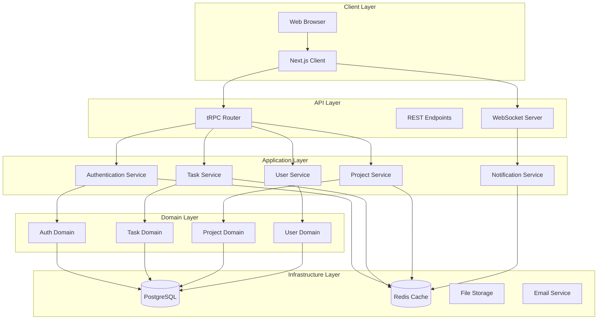
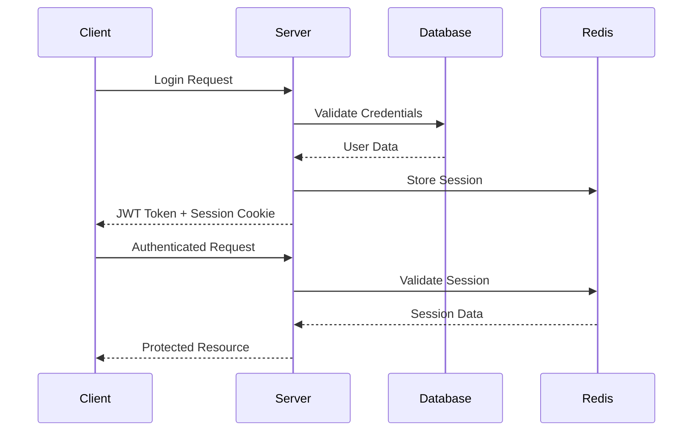

# Architecture Documentation

## Overview

This document describes the architecture of the unified full-stack task management platform, built using a monorepo structure with shared packages and modern development practices.

## System Architecture

### High-Level Architecture



### Monorepo Structure

The project follows a monorepo architecture with the following structure:

```
taskmanagement-fullstack/
├── apps/                           # Applications
│   ├── client/                     # Next.js Frontend
│   └── server/                     # Node.js Backend
├── packages/                       # Shared Packages
│   ├── shared/                     # Core shared logic
│   ├── database/                   # Database package
│   ├── ui/                         # Shared UI components
│   └── config/                     # Shared configuration
└── tools/                          # Development tools
    ├── eslint-config/
    ├── typescript-config/
    └── scripts/
```

## Design Patterns

### Clean Architecture

The backend follows Clean Architecture principles:

1. **Domain Layer**: Contains business entities and rules
2. **Application Layer**: Contains use cases and application services
3. **Infrastructure Layer**: Contains external concerns (database, APIs, etc.)
4. **Presentation Layer**: Contains controllers and API endpoints

### CQRS (Command Query Responsibility Segregation)

Commands and queries are separated for better scalability and maintainability:

- **Commands**: Handle write operations and business logic
- **Queries**: Handle read operations and data retrieval
- **Events**: Handle side effects and cross-cutting concerns

### Repository Pattern

Data access is abstracted through repository interfaces:

```typescript
interface TaskRepository {
  findById(id: string): Promise<Task | null>;
  findByProject(projectId: string): Promise<Task[]>;
  save(task: Task): Promise<void>;
  delete(id: string): Promise<void>;
}
```

## Communication Patterns

### tRPC Integration

Type-safe API communication between client and server:

```typescript
// Server-side router
export const taskRouter = router({
  create: protectedProcedure
    .input(createTaskSchema)
    .mutation(async ({ input, ctx }) => {
      return await ctx.taskService.createTask(input);
    }),
});

// Client-side usage
const { mutate: createTask } = trpc.tasks.create.useMutation();
```

### Real-time Communication

WebSocket-based real-time updates:

```typescript
// Server-side event broadcasting
await websocketService.broadcast('task:updated', {
  taskId,
  update,
  projectId
});

// Client-side event handling
useEffect(() => {
  socket.on('task:updated', (data) => {
    updateTaskInStore(data.taskId, data.update);
  });
}, [socket]);
```

## Data Flow

### Request Flow

1. **Client Request**: User interaction triggers API call
2. **tRPC Router**: Routes request to appropriate handler
3. **Application Service**: Orchestrates business logic
4. **Domain Service**: Executes business rules
5. **Repository**: Persists/retrieves data
6. **Response**: Returns result to client

### Real-time Flow

1. **Server Event**: Business operation triggers event
2. **Event Handler**: Processes event and determines recipients
3. **WebSocket Broadcast**: Sends update to connected clients
4. **Client Update**: Updates UI state optimistically

## Security Architecture

### Authentication Flow



### Authorization Layers

1. **Route Protection**: Next.js middleware for page access
2. **API Protection**: tRPC middleware for endpoint access
3. **Resource Protection**: Domain-level authorization rules
4. **Field Protection**: Selective data exposure based on permissions

## Caching Strategy

### Multi-Layer Caching

1. **Browser Cache**: Static assets and API responses
2. **CDN Cache**: Global content distribution
3. **Application Cache**: In-memory caching with Redis
4. **Database Cache**: Query result caching

### Cache Invalidation

```typescript
// Event-driven cache invalidation
eventBus.on('task:updated', async (event) => {
  await cache.invalidate(`task:${event.taskId}`);
  await cache.invalidate(`project:${event.projectId}:tasks`);
});
```

## Error Handling

### Error Hierarchy

```typescript
abstract class AppError extends Error {
  abstract statusCode: number;
  abstract code: string;
}

class ValidationError extends AppError {
  statusCode = 400;
  code = 'VALIDATION_ERROR';
}

class NotFoundError extends AppError {
  statusCode = 404;
  code = 'NOT_FOUND';
}
```

### Error Boundaries

React Error Boundaries catch and handle client-side errors:

```typescript
class ErrorBoundary extends React.Component {
  componentDidCatch(error: Error, errorInfo: ErrorInfo) {
    errorReportingService.report(error, errorInfo);
  }
}
```

## Performance Considerations

### Database Optimization

- **Indexing**: Strategic indexes on frequently queried columns
- **Connection Pooling**: Efficient database connection management
- **Query Optimization**: Optimized queries with proper joins and filters

### Frontend Optimization

- **Code Splitting**: Lazy loading of components and routes
- **Bundle Optimization**: Tree shaking and dead code elimination
- **Image Optimization**: Next.js automatic image optimization

### Caching Strategy

- **Static Generation**: Pre-built pages for better performance
- **Incremental Static Regeneration**: Dynamic content with static benefits
- **API Response Caching**: Cached responses for frequently accessed data

## Monitoring and Observability

### Metrics Collection

- **Application Metrics**: Response times, error rates, throughput
- **Business Metrics**: User engagement, feature usage
- **Infrastructure Metrics**: CPU, memory, disk usage

### Logging Strategy

```typescript
const logger = createLogger({
  level: 'info',
  format: winston.format.json(),
  transports: [
    new winston.transports.File({ filename: 'error.log', level: 'error' }),
    new winston.transports.File({ filename: 'combined.log' })
  ]
});
```

### Distributed Tracing

Request tracing across services for debugging and performance analysis.

## Deployment Architecture

### Container Strategy

```dockerfile
# Multi-stage build for optimized images
FROM node:18-alpine AS builder
WORKDIR /app
COPY package*.json ./
RUN npm ci --only=production

FROM node:18-alpine AS runtime
WORKDIR /app
COPY --from=builder /app/node_modules ./node_modules
COPY . .
EXPOSE 3000
CMD ["npm", "start"]
```

### Orchestration

Kubernetes deployment with:
- **Horizontal Pod Autoscaling**: Automatic scaling based on load
- **Service Mesh**: Inter-service communication and security
- **Ingress Controllers**: Load balancing and SSL termination

## Development Workflow

### Local Development

1. **Environment Setup**: Automated development environment setup
2. **Hot Reloading**: Instant feedback during development
3. **Type Safety**: End-to-end type safety with TypeScript
4. **Testing**: Comprehensive test suite with fast feedback

### CI/CD Pipeline

```yaml
# GitHub Actions workflow
name: CI/CD Pipeline
on: [push, pull_request]
jobs:
  test:
    runs-on: ubuntu-latest
    steps:
      - uses: actions/checkout@v3
      - name: Setup Node.js
        uses: actions/setup-node@v3
      - name: Install dependencies
        run: npm ci
      - name: Run tests
        run: npm run test:ci
      - name: Build
        run: npm run build
```

## Future Considerations

### Scalability

- **Microservices Migration**: Gradual extraction of services
- **Database Sharding**: Horizontal database scaling
- **Event Sourcing**: Event-driven architecture for complex domains

### Technology Evolution

- **Framework Updates**: Regular updates to Next.js, React, and other dependencies
- **New Features**: Integration of new web platform features
- **Performance Improvements**: Continuous optimization and monitoring

This architecture provides a solid foundation for a scalable, maintainable, and performant full-stack application while maintaining developer productivity and code quality.